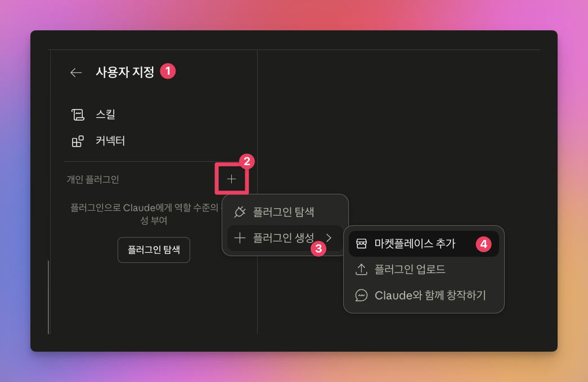
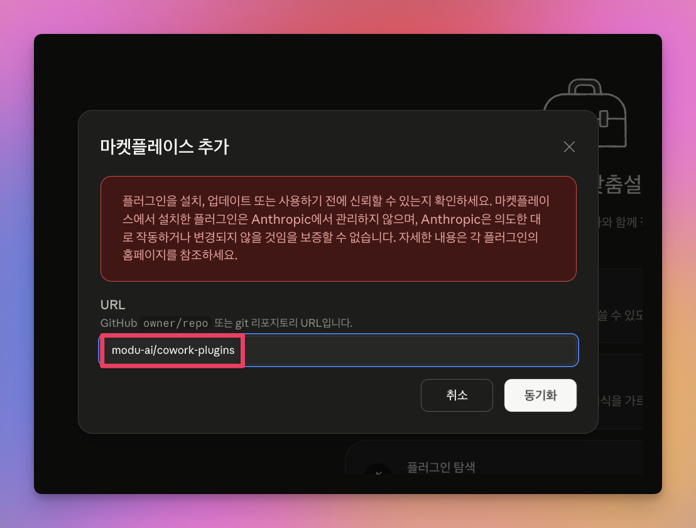
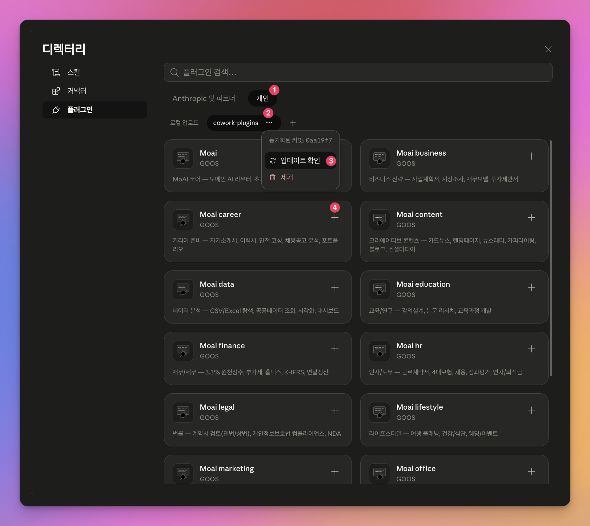
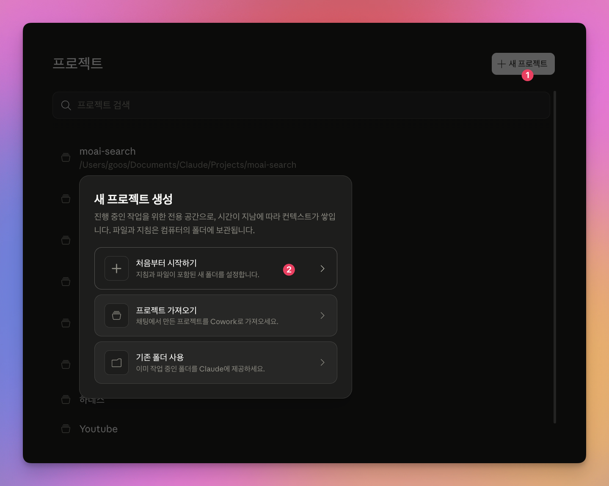
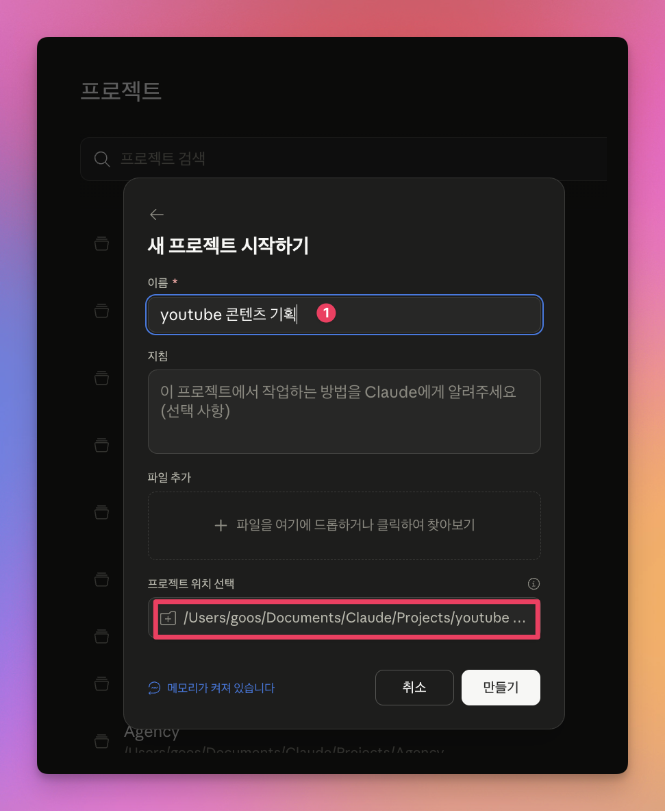
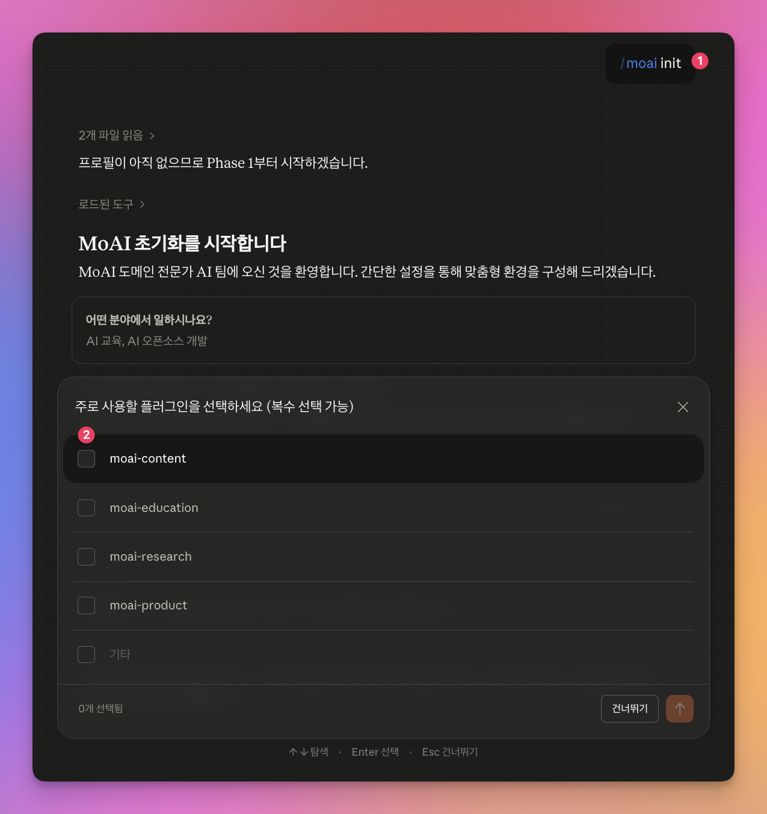

# cowork-plugins

[](LICENSE)
[](https://claude.ai)
[](CHANGELOG.md)
[](.claude-plugin/marketplace.json)
[](.claude-plugin/marketplace.json)
[](https://cowork.mo.ai.kr/)
[](https://ui.shadcn.com/)

**Claude Cowork 한국어 도메인 전문가 AI 마켓플레이스 — 28 plugins · 176 skills · NC-ND v1.0**

자연어 한 줄로 **사업계획서·계약서 검토·세금 계산·PPT·NotebookLM 슬라이드·Claude Design 보조·Higgsfield 이미지·영상·음성 더빙·BI 보고서·HTML 리포트·쿠팡 광고·메타 광고 분석·한국 출판사 제출 원고·한국 공공데이터 조회**를 자동 생성합니다. 한국 B2B 환경(K-IFRS·국세청·근로기준법·식약처·국토부·KRX·인터넷등기소·KPIPA)에 특화된 28개 독립 플러그인과 176개 도메인 스킬이 업무를 대신하며, 모든 텍스트 산출물은 [`ai-slop-reviewer`](./moai-core/skills/ai-slop-reviewer/)가 AI 패턴을 검수하여 자연스럽게 다듬어 드립니다.

> *Korean B2B specialty plugin marketplace for [Anthropic Claude Code (Cowork)](https://claude.ai/cowork) — 28 plugins · 176 skills. Korean fonts (Pretendard / Noto Serif KR / Chosunilbo Myungjo / KoPubWorld), Korean text humanizer (humanize-korean), AI-slop reviewer for every deliverable. Higgsfield MCP image/video (22 official models), Claude Design helper. K-IFRS, NTS, KRX, MFDS, MOLIT, IROS, KPIPA specialty skills. Non-Commercial No-Derivatives (NC-ND) licensed.*

**🚀 빠른 설치**: Claude Cowork → 사용자 지정 → 개인 플러그인 + → **마켓플레이스 추가** → URL `modu-ai/cowork-plugins` 입력 → 동기화 → `moai-core` 먼저 설치

**🔗 바로가기**: [📚 한국어 문서](https://cowork.mo.ai.kr/) · [📦 카탈로그 ↓](#플러그인-카탈로그) · [❓ FAQ ↓](#자주-묻는-질문-faq) · [💬 Discussions](https://github.com/modu-ai/cowork-plugins/discussions) · [📜 Releases](https://github.com/modu-ai/cowork-plugins/releases) · [🐛 Issues](https://github.com/modu-ai/cowork-plugins/issues)

---

## 30초로 살펴보는 cowork-plugins

| 분야 | 대표 스킬 | 산출물 |
|---|---|---|
| 📊 **비즈니스·전략** | `strategy-planner` · `sbiz365-analyst` · `kr-gov-grant` · `proposal-writer` | 사업계획서 · 상권분석(소상공인365) · 정부지원사업 · B2B 제안서 |
| ⚖️ **법률·재무** | `contract-review` · `tax-helper` · `financial-statements` · `iros-registry-automation` · `korean-stock-search` | 계약서 검토 · 세금 · K-IFRS 재무제표 · 등기부등본 일괄발급 · KRX 시세 |
| ✍️ **콘텐츠** | `landing-page` · `humanize-korean` · `html-report` 🆕 v2.2.0 · `ai-slop-reviewer` · `korean-spell-check` | shadcn/ui 랜딩 · 한국어 AI 티 윤문 · 단일파일 HTML 보고서 · AI 슬롭 검수 · 바른한글 맞춤법 |
| 📢 **마케팅·광고** | `meta-ads-analyzer` 🆕 v2.5.0 · `campaign-planner` · `landing-page-conversion-audit` · `pixel-audit` | 메타 광고 보고서 9모듈 분석 · 광고 심리학 캠페인 · 랜딩 진단 · 픽셀 검증 |
| 🎨 **AI 미디어** | `gpt-image-2-prompt` · `gemini-3-image-prompt` · `midjourney-v8-prompt` · `audio-gen` | 3대 모델 공식 가이드 프롬프트 텍스트 빌더 + ElevenLabs 32개 언어 더빙·BGM·효과음 |
| 📑 **문서·이커머스·BI** | `hwpx-writer` · `pdf-writer` · `detail-page-copy` · `executive-summary` · `weekly-report` | HWPX(한글) · 한·중·일·영 PDF · 13섹션 상세페이지 · 경영진 1pager · WBR 주간보고 |

> 28개 플러그인 전체 카탈로그와 카테고리 비교는 [플러그인 카탈로그](#플러그인-카탈로그)와 [플러그인 상세 소개](#플러그인-상세-소개)를 참조하세요.

---

**🆕 v2.27.0 하이라이트** (2026-06-19) — **"design-system-library 56→75종 확장 — getdesign.md 74종 컬렉션 통합 + 강연 테마 추천"**

28 플러그인(유지), **176 스킬**(유지), 동기화 2.27.0. 기능·인터페이스 Breaking change 없음. MINOR 릴리스. `테마_컴포넌트_쇼케이스`의 74종에서 19개 신규 브랜드를 추가해 `design_system` 선택지를 75종으로 확장했습니다.

- **19개 신규 디자인 시스템** — airbnb·apple·stripe·vercel·supabase·linear·bmw·binance 등. design-system-library 56→75종 (light 10 + dark 9).
- **강연/발표 테마 추천 가이드** — 비개발자 청중·프로젝터 환경에서는 라이트(claude·notion·apple·stripe·mintlify)가 안전. 다크는 발표 공간을 어둡게 할 수 있을 때만.
- **getdesign.md 74종 매핑** — 각 design_system에 미리보기 링크로 사용자가 토큰을 직접 확인 후 선택.

기존 워크플로우·플러그인 그대로 동작(기능적 비파괴). `/plugin marketplace update cowork-plugins`로 적용.

---

**🆕 v2.26.0 하이라이트** (2026-06-19) — **"Cowork 베스트프랙티스 정렬 — 28개 플러그인 한글 displayName + orphan 스킬 발견성 개선"**

28 플러그인(유지), **176 스킬**(유지), 동기화 2.26.0. 기능·인터페이스 Breaking change 없음. MINOR 릴리스. Claude Cowork 공식 베스트프랙티스(Connectors·Instructions·Skills 3-Level) 대비 진단·정렬했습니다.

- **28개 플러그인 한글 `displayName`** — Cowork `/plugin` 피커에서 한글 역할명 표시(moai-commerce→"한국 이커머스" 등). 공식 `displayName` 필드(v2.1.143+) 채택.
- **moai-media opt-in 배포** — 외부 API 키(Higgsfield·ElevenLabs) 의존 플러그인을 신규 설치 시 비활성(`defaultEnabled:false`, v2.1.154+). 기존 사용자는 활성 유지.
- **commerce 스킬 발견성 개선** — orphan 스킬 12개(marketplace-*·coupang-ad·live-commerce·VOC 등)를 `commerce-launch-coordinator`·`commerce-growth-analyst`에 매핑. 자동 호출 강화.
- **skill-only 플러그인 의도 명시** — moai-bi·lifestyle·pm·tutor README에 "코디네이터 없이 직접 호출 전용(의도적)" 설계 노트.

기존 워크플로우·플러그인 그대로 동작(기능적 비파괴). `/plugin marketplace update cowork-plugins`로 적용.

---

**🆕 v2.25.0 하이라이트** (2026-06-19) — **"28 플러그인 전수 품질 감사 + pdf-writer weasyprint 재작성 + 리다이렉트 stub 2개 제거"**

28 플러그인 유지, 178 → **176 스킬**(리다이렉트 stub 2개 제거), 동기화 2.25.0. 기능·인터페이스 Breaking change 없음. MINOR 릴리스. "PDF로 생성"이 `pdf-writer`로 안정적으로 라우팅되도록 트리거·엔진을 개선하고 전 플러그인 지침을 정정했습니다.

- **pdf-writer 미발동 근본 해소** — weasyprint 단일 엔진 재작성(스타일 HTML 디자인 보존 + Noto Sans CJK `@font-face`) + 일반 트리거 보강 + "weasyprint 직접 설치 말고 스킬 사용" 포지셔닝. office·media 산출물 스킬도 동일 포지셔닝, html-report/html-slide→pdf 핸드오프 신설.
- **전수 콘텐츠 감사 정정** — 끊긴 cross-ref·deprecated 참조(`social-media`→`sns-content`)·미번들 MCP 호출·노후 사실(FID→INP·이베이→지마켓·나라장터 웹표준·자살예방 109)·오탈자. 미검증 도메인 수치(세법·과징금·요율)는 공식 출처 참조로 완화.
- **리다이렉트 stub 2개 제거** — `ai-diagnostic`·`course-curriculum-design` → 178→176 스킬, `/ai-diagnostic` 이름 충돌 해소.

<details>
<summary>이전 하이라이트 (v2.24.0)</summary>

**🆕 v2.24.0 하이라이트** (2026-06-17) — **"html-slide 신규 — 단일 파일 HTML 슬라이드 덱 + 편집 가능 PPTX + 인라인 SVG 인포그래픽 + getdesign.md 미리보기"**

28 플러그인(유지), 177 → **178 스킬**, 동기화 2.24.0. 기능·인터페이스 Breaking change 없음. MINOR 릴리스. 발표용 슬라이드 덱을 브라우저에서 바로 열리는 단일 파일 HTML로 생성합니다.

- **`html-slide` 신규 스킬 (moai-content)** — 단일 파일 무의존 HTML 슬라이드 덱(16:9, `?print-pdf` 인쇄, speaker notes). 인포그래픽은 인라인 SVG(한국어 숫자/라벨 100% 정확), 실사 히어로는 Higgsfield MCP / codex(gpt-image-2). design-system-library 56 브랜드 토큰 + getdesign.md 링크 미리보기. 편집 가능 PPTX는 pptx-designer 체이닝.
- **이미지 백엔드 정책 변경** — Higgsfield + codex(gpt-image-2) 복수로 확장. codex exec가 ChatGPT 구독 한도로 gpt-image-2 호출(API 키 불필요). 그 외 외부 이미지 백엔드는 사용하지 않습니다.

기존 워크플로우·플러그인 그대로 동작(기능적 비파괴). `/plugin marketplace update cowork-plugins`로 적용.

---

**🆕 v2.23.0 하이라이트** (2026-06-17) — **"drawio-diagram 스킬 제거 — 다이어그램은 mermaid(인라인, 안정)로 단일화"**

28 플러그인(유지), 178 → **177 스킬**, 동기화 2.23.0. 기능·인터페이스 Breaking change 없음. MINOR 릴리스. `drawio-diagram` 스킬의 `viewer-static.min.js` CDN 렌더링이 drawio XML마다 불안정(검증 21개 중 2개만 성공)하여 스킬 가치를 훼손하는 문제로 배포용 스킬에서 제거했습니다.

- **`drawio-diagram` 스킬 제거 (moai-content)** — `viewer-static.min.js` CDN 렌더링이 drawio XML마다 불안정(검증 21개 중 2개만 성공)하여 스킬 가치를 훼손합니다. 배포용 스킬에서 제거하고 다이어그램은 **mermaid(인라인, 안정)**로 통일했습니다. docs-site 등 로컬 문서의 정교 도식은 **draw.io desktop CLI(로컬 전용)**로 SVG를 생성해 마크다운 이미지로 인라인 사용합니다(CLAUDE.local.md §10-6).
- **`moai-tutor:learning-material` drawio 연동 제거** — ```drawio` 블록 지원을 제거하고 mermaid로 수렴했습니다. mermaid 도식 기능은 그대로 유지됩니다.

기존 워크플로우·플러그인 그대로 동작(기능적 비파괴). `/plugin marketplace update cowork-plugins`로 적용.

---

**🆕 v2.22.0 하이라이트** (2026-06-16) — **"design-system-library 신규 — 56개 글로벌 브랜드 디자인 시스템 → Tailwind Play CDN + shadcn vanilla HTML"**

28 플러그인(유지), 177 → **178 스킬**, 동기화 2.22.0. 기능·인터페이스 Breaking change 없음. MINOR 릴리스. HTML 보고서·랜딩·문서에 즉시 적용 가능한 브랜드 디자인 시스템 라이브러리를 추가했습니다.

- **`design-system-library` 신규 (moai-design)** — Claude·ClickHouse·Clay 기본 3테마 + 글로벌 56종(Notion·Linear·Stripe·Vercel·Figma·Sentry·Raycast 등) 디자인 시스템 토큰(색·타이포·radius·spacing·컴포넌트)을 단일 진실 원천으로 보관. `html-report`에 `design_system` 파라미터로 지정하면 Tailwind Play CDN config + shadcn 스타일 vanilla 컴포넌트로 브랜드 무드를 즉시 적용. **CLI 설치·빌드 불필요**(단일 HTML 파일, 외부 의존은 CDN 1개). Claude Design 핸드오프 시 DESIGN.md 지침 소스로도 사용.
- **자동 추천 휴리스틱** — 산출물 성격에 따라 테마 자동 추천(주간현황·사업계획서→`claude` warm editorial / 인시던트·데이터 리포트→`clickhouse` 다크 / 랜딩·마케팅→`clay` playful). `design_system` 미지정 시 기존 0의존 템플릿 유지(하위 호환).
- **분류 완료 48종 + 후속 8종** — 56개 중 48종은 휘도 기반 분류(light 33 · dark 13 · warm 2) 완료, 8종(theverge·tesla·starbucks·spotify·mastercard·lovable·lamborghini·kraken)은 colors 구조 후속 보완 예정.

기존 워크플로우·플러그인 그대로 동작. `/plugin marketplace update cowork-plugins`로 적용.

---

**🆕 v2.21.0 하이라이트** (2026-06-16) — **"drawio-diagram 신규 + humanize-korean 한국적 정서·결 K 카테고리 + /project agent-aware"**

28 플러그인(유지), 173 → **177 스킬**, 동기화 2.21.0. 기능·인터페이스 Breaking change 없음. MINOR 릴리스. 콘텐츠·문서 작업의 도식 역량을 강화하고 한국적 정서 윤문 지식을 보강했습니다.

- **`drawio-diagram` 신규 (moai-content)** *(v2.23.0에서 제거됨 — CDN 렌더링 불안정)* — 당시 자연어를 편집 가능한 `.drawio` + 단일 HTML(draw.io CDN 뷰어 `viewer-static.min.js`, Apache-2.0) 두 산출물로 렌더하는 스킬로 도입됐으나, CDN 렌더링이 drawio XML마다 불안정(검증 21개 중 2개만 성공)하여 v2.23.0에서 배포용 스킬을 제거하고 다이어그램은 mermaid로 통일했습니다. 릴리스 이력으로 보존.
- **`humanize-korean` 한국적 정서·결 K 카테고리 (taxonomy v2.1)** — 기존 A~J(음성·제거 축)에 **K(양성·지향 축)** 4종(K-1 정서온도·K-2 절제·곡언·K-3 구어 호흡·K-4 정서 아크) 추가. 본진 E-8(띄어쓰기 기계적 균일성)·E-7 보강(3단계 화계)·머리말 모델별 번역투 시그니처 힌트. Park & Han 2026 LREAD(arXiv:2601.19913)·translationese(arXiv:2602.16469) 학술 교차. **메트릭·테스트 무변경**(parity 안전).
- **`/project` agent-aware 강화 (moai-core)** — `/project init`이 스킬뿐 아니라 **코디네이터 에이전트**까지 동적 스캔·체인 설계. 신규 `agent-catalog.md` SSOT + Phase 2 에이전트 인벤토리 + Phase 3 코디네이터 우선 + 기존 에이전트 우선(stale 정정).
- **`moai-tutor:learning-material` drawio 연동** *(v2.23.0에서 제거됨)* — ```drawio` 블록을 인식해 draw.io 뷰어를 조건부 임베드하는 연동이었으나, v2.23.0에서 drawio-diagram 제거와 함께 ```drawio` 블록 지원을 제거하고 mermaid로 수렴했습니다. 릴리스 이력으로 보존.

기존 워크플로우·플러그인 그대로 동작. `/plugin marketplace update cowork-plugins`로 적용.

---

**🆕 v2.20.0 하이라이트** (2026-06-16) — **"학습자 전용 moai-tutor 신규 — context7+웹검색 병렬 리서치 → mermaid·차트 HTML 학습자료"**

27 → **28 플러그인**, 173 → **176 스킬**, 동기화 2.20.0. 기능·인터페이스 Breaking change 없음. MINOR 릴리스. 가르치는 사람(moai-education)과 분리된 **배우는 사람(학습자·수강생)** 도메인을 신설했고, 저장소 라이선스를 **MIT → NC-ND 1.0**으로 전환했습니다.

- **`moai-tutor` 신규 (3 스킬)** — `learning-project`(내 학습 프로젝트·로드맵·진도 추적 초기화) · `tutor-research`(질문→context7 공식문서+웹검색 **병렬** 조사·교차검증) · `learning-material`(도식·차트·수식·코드가 조건부로 들어간 단일 HTML 학습자료 생성). claude code·cowork·영어 등 어떤 주제든 최신 정보로 스스로 학습.
- **context7 MCP 번들** — `moai-tutor/.mcp.json`에 context7을 번들해 설치 시 라이브러리·SDK 공식 문서 조회가 함께 활성화(별도 API 키 불필요).
- **2026 CDN 라이브러리 스택 큐레이션** — learning-material 렌더러는 Mermaid v11·Apache ECharts v5·highlight.js v11·KaTeX v0.16·AOS v2를 **조건부 로딩**(콘텐츠가 쓸 때만 주입, 순수 텍스트는 JS 0). `moai-content:html-report`의 0-JS 원칙은 보존.
- **라이선스 MIT → NC-ND 1.0 전환 + humanize-korean 자체 재생성** — 저장소를 비상업·변경금지(NC-ND) 1.0으로 전환(종전 MIT 릴리스는 `LICENSE.MIT`로 보존, 제3자 구성요소는 `NOTICE.md` 격리). `moai-content:humanize-korean`의 MIT 차용 의존을 100% 제거하고 한국 번역학계 8유형 번역투 계보 기반 자체 저작으로 재생성 — 검증된 구조(10대 카테고리·CLI·등급 로직) 보존, 기능 동등(28 테스트 PASS).

기존 워크플로우·플러그인 그대로 동작. `/plugin marketplace update cowork-plugins`로 적용.

**🆕 v2.19.0 하이라이트** (2026-06-15) — **"humanize-korean v2.0.0 포팅 + Cowork-safe 플러그인 코디네이터 31종 재도입"**

27 플러그인 · 173 스킬 유지, 동기화 2.19.0. MINOR 릴리스. Breaking change 없음.

- **humanize-korean v2.0.0 정렬** — upstream epoko77-ai/im-not-ai v1.6.1 → v2.0.0 포팅. 한국 번역학계 8유형 번역투 계보 + 신규 패턴 A-16(영어 대명사 직역)·A-18(관계절 좌향 수식)·A-19(이중 조사)·E-7(청자 경어법 일관성) 추가. post-editese 14메트릭(metrics_v2.py) + scholarship.md(학술 출처) 신규. 22→24 테스트 PASS.
- **Cowork-safe 코디네이터 31종 선별 재도입** — 24 플러그인, `moai-*/agents/`. tools는 Read/Grep/Glob/Write/Edit/WebSearch만(Bash·WebFetch 배제). 텍스트 산출 체인은 `ai-slop-reviewer → humanize-korean`으로 마감. v2.18.0 `/project` Agent Synthesis와 공존.

기존 워크플로우 그대로 동작. `/plugin marketplace update cowork-plugins`로 적용.

**🆕 v2.18.0 하이라이트** (2026-06-15) — **"Cowork 에이전트 모델 전환 — 플러그인 번들 코디네이터 제거 + /project 맞춤 에이전트 생성"**

27 플러그인 · 173 스킬 유지, 동기화 201지점 2.18.0. MINOR 릴리스. v2.17.0의 플러그인 번들 코디네이터 sub-agent를 전면 제거하고, `/project`가 사용자 워크플로우에 맞춘 전담 에이전트를 직접 생성하는 모델로 전환했습니다. 기존 스킬 체인은 자연어 인라인 호출로 동일하게 동작합니다.

- **`/project` Agent Synthesis (신규)** — 초기화 인터뷰에서 자격 워크플로우(고정 다단계+비우회 게이트, 병렬 fan-out, 빈번 반복)에 한해 사용자 프로젝트 `.claude/agents/`에 맞춤 sub-agent를 생성합니다. 프로젝트 에이전트는 플러그인 번들보다 우선순위가 높고 Cowork이 자동 로드합니다(새 세션에서 활성화).
- **플러그인 번들 코디네이터 14종 제거** — 우선순위 최하위·설치 버전 게이트·orchestrator 중복이던 번들 에이전트를 제거. 동일 작업은 자연어로 스킬 체인을 인라인 호출하면 같은 결과이며, 전담 에이전트가 필요하면 `/project`로 생성합니다.
- **moai-core:project 스킬 현대화** — 22→27 플러그인 / 143→173 스킬 정합, Phase 2 인벤토리 화이트리스트 동적 도출(신규 5개 플러그인 누락 버그 해소), 폐기된 harness 모델·글로벌 프로필 잔재 제거.
- **커맨드 표면 단순화** — bare `/project`가 초기화 기본 동작. `/project init`은 레거시 별칭으로 계속 인식(비파괴).

기존 워크플로우·플러그인 그대로 동작. `/plugin marketplace update cowork-plugins`로 적용.

<details>
<summary><b>📜 이전: v2.17.0 — Cowork-fit 재설계 — moai-public-data 신규 + 코디네이터 11종 + 매니페스트 정직화</b></summary>

**🆕 v2.17.0 하이라이트** (2026-06-14) — **"Cowork-fit 재설계 — moai-public-data 신규 + Cowork 코디네이터 11종 + 매니페스트 정직화"**

26 → **27 플러그인**, 170 → **173 스킬**, 동기화 지점 198 → **201**. Breaking change 없음. MINOR 릴리스. 별칭·스텁 호환을 유지한 채 Cowork 사용 적합성(taxonomy·체이닝·매니페스트)을 4축으로 재설계했습니다.

- **`moai-public-data` 신규 (4 스킬)** — 한국 공공데이터 조회 단일 도메인. `korean-stock-search`(KRX 시세)·`court-auction-search`(법원경매)·`real-estate-search`(국토부 실거래가)·`public-data`(공공데이터포털/KOSIS)를 흩어진 도메인에서 한곳으로 모았습니다. 기존 위치는 별칭·스텁으로 호환 유지.
- **Cowork 코디네이터 서브에이전트 11종** — 커머스 런칭·상세페이지·도서 원고·사업계획서·채용·법무 검토·메타 광고·미디어 파이프라인·티켓 일괄 분류·UX 감사·재무 보고 조립. 멀티 스킬 파이프라인을 한 번에 실행합니다(Cowork 전용 — Chat에서는 개별 스킬을 인라인 호출해 동일 결과).
- **매니페스트 정직화 + 체이닝 표준화** — moai-pm(weekly-report)·moai-sales(proposal-writer)·moai-bi(executive-summary)를 실제 보유 스킬만 노출하도록 정정. 60종+ 스킬에 `ai-slop → humanize` 체이닝과 자연어 트리거(description+trigger STANDARD)를 일괄 적용.
- **이미지 정책 단일화** — `mcp-connector-setup`의 Connector D(OpenAI/GPT Image 2)를 제거하고 이미지 생성은 Higgsfield 단일로 통일. WordPress 발행 커넥터를 blog·newsletter에 연결.

기존 워크플로우·플러그인 그대로 동작(별칭·스텁 호환). `/plugin marketplace update cowork-plugins`로 적용.

</details>

<details>
<summary><b>📜 이전: v2.16.0 — 개인·일잘러 도메인 3종 신규 (moai-wealth · moai-productivity · moai-comms)</b></summary>

**🆕 v2.16.0 하이라이트** (2026-06-13) — **"개인·일잘러 도메인 3종 신규 — moai-wealth · moai-productivity · moai-comms"**

23 → **26 플러그인**, 152 → **170 스킬**, 동기화 지점 176 → **198**. Breaking change 없음. MINOR 릴리스. 사용자 실무 지식 데이터(vault) 2,219개 노트 전수 분석으로 도출한 커버리지 공백 3종을 채웠습니다.

- **`moai-wealth` 신규 (6 스킬)** — 개인 재무·재테크. 재테크 로드맵(현황 진단·종잣돈 4단계·자산 배분)·가계부(통장 쪼개기·50/30/20·소비 회고)·투자 입문(분산·장기·리스크·투자 사기 회피)·보험 설계(과보험 점검·생애주기 리모델링)·근로자 연말정산 절세(소득공제 vs 세액공제·연금저축/IRP)·경제지표 읽기. **법인 세무(moai-finance)와 분리된 개인 자산관리 도메인.**
- **`moai-productivity` 신규 (7 스킬)** — 자기관리·생산성. 회고(KPT·연간)·목표관리(12주·만다라트·개인 OKR)·시간관리(블록식스·덩어리 시간)·습관/루틴 설계·번아웃 자기돌봄·노션 올인원 템플릿·주간업무보고. **개인 자기관리 특화(팀 PM은 moai-product).**
- **`moai-comms` 신규 (5 스킬)** — 직장 커뮤니케이션. 보고·설명의 기술(두괄식)·회의 진행·피드백 주고받기·갈등/소통빌런 대응·1:1 면담·협상. **대인 커뮤니케이션 실전.**

기존 워크플로우·플러그인 그대로 동작. `/plugin marketplace update cowork-plugins`로 적용.

</details>

<details>
<summary><b>📜 이전: v2.14.1 — moai-office NotebookLM 슬라이드 데크 프롬프트 빌더 추가</b></summary>

**🆕 v2.14.1 하이라이트** (2026-05-26) — **"moai-office에 NotebookLM 슬라이드 데크 프롬프트 빌더 추가"**

23 플러그인 유지, **150 → 151 스킬**, 동기화 지점 175 → **176**. Breaking change 없음. PATCH 릴리스.

- **`notebooklm-slide-prompt` 신규** — 강연·강의·세미나 본문 마크다운을 입력받아 (A) **NotebookLM Studio 슬라이드 데크 프롬프트** + (B) **슬라이드별 나노바나나(Gemini 3 Pro Image) 5-Component 이미지 프롬프트**를 동시 산출하는 prompt-builder. NotebookLM 공식 4축(Format `Detailed Deck` / `Presenter Slides`, Length `short` / `default` / `long`, Output language, Prompt 6블록 템플릿) 정확 매핑. DeepMind 공식 5-Component(Style · Subject · Setting · Action · Composition) + 시리즈 일관성 태그 자동 생성. 권장 체인: `notebooklm-slide-prompt → moai-core:ai-slop-reviewer`.
- **49 시각 스타일 라이브러리 내장** — `references/slide-style-library.md`에 8 카테고리(모던 웹·비즈니스·교육·레트로·시네마틱·일러스트·라이프스타일·한국형) × 49 스타일 카탈로그. 발표 키워드 → 스타일 자동 매칭 규칙, 시리즈 일관성 가드(Style·Palette·Lighting·Consistency tag), 안티패턴 카탈로그 포함. Progressive Disclosure로 본문 토큰 최소화.
- **moai-office 5 → 6 스킬** — pptx-designer는 PPT 직접 생성, notebooklm-slide-prompt는 NotebookLM 프롬프트 빌더로 역할 분리. NotebookLM 사용자는 Studio에 본문 MD를 노트북 **소스로 업로드** 후 산출된 Prompt 블록을 그대로 붙여 슬라이드 데크 생성, 표지·핵심 슬라이드 이미지는 별도 Nano Banana Pro로 생성 후 NotebookLM에서 revise로 교체.

기존 워크플로우 그대로 동작. `/plugin marketplace update cowork-plugins`로 적용.

</details>

<details>
<summary><b>📜 이전: v2.14.0 — Claude Design 보조 docs·스킬 정합성 보완 (Anthropic 공식 발표 2026-04-17 정확 반영)</b></summary>

23 플러그인·150 스킬 유지, 동기화 지점 175. Breaking change 없음. 신규 스킬·플러그인 없이 정확성·정합성 보완에 집중한 MINOR 릴리스.

- **A. 코드 기반 프로토타입 카테고리 명시** — Anthropic 공식이 강조한 *"code-based prototypes with audio, video, shaders, 3D"* 영역을 `getting-started` Hello World·`use-cases` 디자이너 시나리오·`limitations` #4에 정확히 반영. 인터랙티브 HTML+JS 출력 vs 독립 비디오 파일(.mp4) 미지원의 정확한 경계 명시
- **B. Canva 네이티브 통합 워크플로우 강화** — `export-handoff`에 Canva 공식 파트너십·CEO Melanie Perkins 인용·마케팅 후속 편집 mermaid 워크플로우 추가. `claude-design-handoff-reader`에 "Claude Code 빌드 vs Canva 마케팅 후속" **두 경로 분기** 표 신규
- **C. 통합 빌더 단기 로드맵 명시** — *"Over the coming weeks, we'll make it easier to build integrations with Claude Design"* Anthropic 공식 약속을 `limitations`에 외부 추정과 분리해 별도 섹션으로
- **D. Brilliant·Datadog 공식 인용 추가** — `best-practices`에 도입 사례 인용으로 원칙 1·9 신뢰성 강화 (Olivia Xu·Aneesh Kethini)
- **`claude-design-prompt-builder` 보조 패턴 신규** — WebGL 셰이더·Three.js 3D·Web Audio API·캔버스 애니메이션 4영역 권장 ROLE·CONSTRAINTS 추가 (11번째 정식 패턴은 아니며 명시적 미디어 키워드에만 활성화)
- **루트 README 카탈로그 누락 정정** — moai-book·moai-design 두 행이 v2.13 릴리스 시 누락되어 있던 점 정정 (21 → 23행)

</details>

<details>
<summary><b>📜 이전: v2.13.0 — moai-media Higgsfield MCP 직접 호출 — higgsfield-image · higgsfield-video 신규 2 스킬</b></summary>

23 플러그인 유지, **148 → 150 스킬**, 동기화 지점 173 → **175**. Breaking change 없음.

- **`higgsfield-image` 신규** — [higgsfield.ai](https://higgsfield.ai) 공식 **11 이미지 모델** 자연어 한 줄 호출. Soul · Soul 2.0 · Soul Cinema · Nano Banana · Nano Banana Pro · GPT Image · GPT Image 2 · Seedream 4.0 · Flux Kontext · Wan 2.2 Image · Wan 2.5. 키워드 매칭 자동 선택(글자·카드뉴스→**GPT Image 2 1순위**, 시네마틱→Soul Cinema, 사진→Flux Kontext). Soul Characters reference로 캐릭터 시리즈 일관성. 비동기 잡 폴링·5 비율 매핑·1080p/2K/4K.
- **`higgsfield-video` 신규** — 공식 **11 영상 모델** + **6 비디오 프리셋** 직접 호출. Sora 2 · Google Veo 3 · Kling 2.1 Master · Kling 2.5 Turbo · Kling 3.0 · Kling Avatars 2.0(캐릭터 일관성) · Seedance 2.0 · Seedance Pro · Cinema Studio 3.5 · MiniMax Hailuo 02 · Wan 2.5. 프리셋: UGC · Unboxing · Product review · Hyper motion · TV spot · Wild Card.
- **`.mcp.json` 자동 등록** — `moai-media` 활성화 시 Higgsfield hosted MCP(`https://mcp.higgsfield.ai/mcp`, OAuth)와 ElevenLabs MCP(uvx stdio) 2종 자동 등록. API 키 별도 발급 불필요(OAuth 1회).

</details>

<details>
<summary><b>📜 이전: v2.12.x — moai-design 신규 + Claude Design 가이드 + moai-office 모던 디자인 + card-news 보강</b></summary>

v2.12.0 (MINOR) + v2.12.1·v2.12.2·v2.12.3 (PATCH) 묶음. 22 → **23 플러그인**, 143 → **148 스킬**, 동기화 지점 167 → **173**.

- **v2.12.0 — moai-design 신규 플러그인 + docs-site 클로드 디자인 섹션 10페이지**
  - [`claude-design-brief`](./moai-design/skills/claude-design-brief/) — 6요소 브리프(Project·Audience·Pages·Tone·Reference·Constraints) 자동 채움 + AI 슬롭 회피 블록
  - [`claude-design-system-prep`](./moai-design/skills/claude-design-system-prep/) — 브랜드 자산 5종 → DESIGN.md 합성
  - [`claude-design-prompt-builder`](./moai-design/skills/claude-design-prompt-builder/) — 시니어 UX 10 패턴 자동 선택·완성
  - [`claude-design-handoff-reader`](./moai-design/skills/claude-design-handoff-reader/) — Claude Code 핸드오프 번들 분석 + 1줄 지시 자동 생성
  - [`claude-design-slop-check`](./moai-design/skills/claude-design-slop-check/) — 영문·한국어 AI 슬롭 패턴 검출 + 수정 대안 3개
  - docs-site에 **클로드 디자인 섹션 10페이지** 동시 신설

- **v2.12.1 — moai-office docx·pptx 모던 디자인 시스템 대형 보강**
  - `docx-generator` — Claude 톤 색·6 문서 유형별 템플릿·모던 디자인 패턴 6종·10단계 QA
  - `pptx-designer` — 10 큐레이션 팔레트·9 비즈니스 슬라이드 아키타입·5 폰트 페어링·HTML-First·자동 QA

- **v2.12.2·v2.12.3 — moai-content:card-news 보강·정련**
  - 10 구성 패턴 자동 선택 (A·B 듀얼·순차 빌드·체크박스·궁금증·함정·첫 발·개념 사전·페인 솔루션·실전 사례·즉시 활용)
  - 5 디자인 톤 (Soft Cream·Claude Modern·Corporate Trust·Playful Pop·Bold Dark)
  - 8단계 워크플로우·채널별 캡션·4·7·10장 분량 확장

</details>

<details>
<summary><b>📜 이전: v2.11.0 — moai-media 16→4 정리 + 플러그인 페이지 책임 경계 재정렬</b></summary>

22 플러그인 유지, **155 → 143 스킬**, 동기화 지점 178 → **166**. Breaking change 없음.

- **moai-media 16→4 축소** — 이미지·영상·음성 직접 호출 12 스킬 제거. 해당 영역은 **Higgsfield MCP + ElevenLabs MCP**가 이미 직접 지원하므로 wrapper 정리. 유지 4: [`gpt-image-2-prompt`](./moai-media/skills/gpt-image-2-prompt/) · [`gemini-3-image-prompt`](./moai-media/skills/gemini-3-image-prompt/) · [`midjourney-v8-prompt`](./moai-media/skills/midjourney-v8-prompt/) (3대 모델 공식 가이드 기반 프롬프트 텍스트 빌더) + [`audio-gen`](./moai-media/skills/audio-gen/) (ElevenLabs 32개 언어 더빙·BGM·효과음)
- **moai-commerce 페이지 재작성** — 35 스킬 도메인 카탈로그(시장조사·JTBD·페르소나·상품명·통합전략 등 9 카테고리)로 정렬
- **moai-education 범용화** — 강사·교수·교사 교육 콘텐츠 풀스택으로 재정의. 1일~16주 모든 코스 형식 지원
- **moai-career 한국 채용 2026 재설계** — 팀핏 면접·핀셋 채용·AI 진정성·4 플랫폼 MAU·헤드헌터 5축·NCS·블라인드 반영
- **moai-bi html-report 중심 재정의** — `executive-summary` 산출물을 단일 HTML 파일로 통일. pdf/docx/pptx/hwpx는 옵션 변환
- **docs-site 일관성 정비** — 물결 `~` 사고 정정(266+ 파일 1,000+), mermaid 가로→세로(67 파일 77 블록), 터미널 prompt shortcode 통일, hugo.toml SSOT 도입

</details>

<details>
<summary><b>📜 이전: v2.10.0 — moai-book 신규 플러그인 한국 출판 풀스택</b></summary>

신규 플러그인 **moai-book** 도입. 도서 컨셉서부터 출판사 매칭·본문 집필·퇴고까지 8 단계 워크플로우를 단일 플러그인에 통합. 실용서·인문·기술·소설 4 장르 자동 분기. 한국 출판 컨텍스트(KPIPA·국립국어원·도서정가제·교보문고·알라딘 베스트셀러) + 30+ 출판사 라이브러리 + 자비 출판 5 플랫폼(부크크·텀블벅 등) 내장. **21 → 22 플러그인 · 147 → 155 스킬 · 동기화 지점 169 → 178**.

- **moai-book 신규 8 (출판 워크플로우 풀스택)**
  - [`book-concept-planner`](./moai-book/skills/book-concept-planner/) — 도서 컨셉서. 의도파악 → 리서치 → 인사이트 도출 3단계. 한 줄/30자/300자 요약 + USP 3축 + 시장 포지셔닝 매트릭스.
  - [`book-target-reader`](./moai-book/skills/book-target-reader/) — 타깃 독자 페르소나. 4축 카드 + JTBD 3 차원(기능·감정·사회) + 페인포인트 강도×빈도 매트릭스 + 독서 행동 데이터.
  - [`book-outline-designer`](./moai-book/skills/book-outline-designer/) — 목차 설계. 부·장·꼭지 3 레벨 트리 + 분량 배분 + 챕터 시놉시스 5요소 + 페르소나 여정 검증.
  - [`book-author-bio`](./moai-book/skills/book-author-bio/) — 저자 약력. 3 신호(권위·공감·변화) + 3 길이 약력(50/200/500자) + 저자의 말 4단 구조 + SNS 채널별.
  - [`book-proposal-writer`](./moai-book/skills/book-proposal-writer/) — 출판사 투고 제안서. 출판기획서 + 샘플 챕터 + 마케팅 플랜 3 패키지. 거절 신호 사전 검출.
  - [`book-publisher-matcher`](./moai-book/skills/book-publisher-matcher/) — 한국 출판사 매칭. 4 차원 평가(장르·규모·계약·채널) + Top 5 우선순위 + 거절 후 시나리오 + 30+ 출판사 라이브러리.
  - [`book-chapter-writer`](./moai-book/skills/book-chapter-writer/) — 챕터 본문 집필. 꼭지 5요소(훅·본문·클라이맥스·정리·연결) + 4 장르 문체 + 200자 원고지 매수 + 인용·도표·코드 처리.
  - [`book-revision-coach`](./moai-book/skills/book-revision-coach/) — 퇴고·교열 7 단계(어법·문체·논리·인용·분량·시각자료·일관성). korean-spell-check → humanize-korean → ai-slop-reviewer 4 체인의 첫 단계.

- **공통 사양** — 4 장르 자동 분기, 한국 출판사 30+ 라이브러리, KPIPA·국립국어원·교보문고·알라딘 공식 출처 인용, 자비 출판 5 플랫폼(부크크·텀블벅·인디고·카카오 브런치북·출판사 자비) 대안 포함
- **풀스택 워크플로우** — `book-concept-planner → book-target-reader → book-outline-designer → book-author-bio → book-proposal-writer → book-publisher-matcher → book-chapter-writer → book-revision-coach → moai-content:korean-spell-check → moai-content:humanize-korean → moai-core:ai-slop-reviewer`
- **루브릭 자가 평가** 8 스킬 모두 가중 평균 0.85 (통과 기준 0.70 ✅), ai-slop 검수 8개 모두 **APPROVE**

</details>

<details>
<summary><b>📜 이전: v2.9.0 — moai-media 이미지 프롬프트 빌더 3종</b></summary>

moai-media 신규 3 스킬 추가 (OpenAI/Google/Midjourney 공식 가이드 기반). AskUserQuestion 프리셋·미세조정으로 컨텍스트를 수집해 3개 모델 프롬프트를 동시 출력. 144 → **147 스킬**, 동기화 지점 166 → **169**.

- **moai-media 신규 3 (프롬프트 빌더)**
  - [`gpt-image-2-prompt`](./moai-media/skills/gpt-image-2-prompt/) — OpenAI GPT-image-2 전용. [OpenAI Cookbook](https://developers.openai.com/cookbook/examples/multimodal/image-gen-models-prompting-guide) 6-Block 구조(Subject·Action·Scene·Composition·Lighting·Style&Text) + 편집 시 Change/Preserve/Constraints 2열 로직 + 텍스트 verbatim 다국어(한·일·중·힌·벵골).
  - [`gemini-3-image-prompt`](./moai-media/skills/gemini-3-image-prompt/) — Google Gemini 3 Pro Image (Nano Banana Pro) 전용. [Google AI for Developers](https://ai.google.dev/gemini-api/docs/models/gemini-3-pro-image-preview) 5-component 구조 + Creative Director 어조 + 카메라 하드웨어 지정(Fujifilm·GoPro·iPhone) + Reference image 14 슬롯 + Search Grounding + Thinking 모드.
  - [`midjourney-v8-prompt`](./moai-media/skills/midjourney-v8-prompt/) — Midjourney v8.1 전용. [Midjourney Parameter List](https://docs.midjourney.com/hc/en-us/articles/32859204029709-Parameter-List) 기반 키워드+`--파라미터` + `--sref`/`--oref`/`--cw`/`--p` 3대 reference 시스템 + 6대 비용·동작 함정 자동 검사(`--hd --q 4` 16x cost, `--cw 100` 상속 함정, `--cref` deprecation 교체).

- **공통 사양** — AskUserQuestion 라운드 ≤ 3, 4 프리셋(제품샷·인물·일러스트·풍경) × 4 슬롯, 3개 모델 동시 출력(자기 모델 메인 + 다른 2개 보조), 한국어 해설, 페어 스킬(image-gen·higgsfield-image·media-gpt-image2-builder) 안내
- **책임 경계** — 본 스킬 3종은 **프롬프트 텍스트만 산출**. 실제 이미지 생성은 페어 스킬 또는 사용자가 ChatGPT/Google AI Studio/Discord에서 직접 실행
- **루브릭 자가 평가** 0.805 - 0.815 (통과 기준 0.70 ✅), AI Slop 검수 3개 모두 **APPROVE**

<details>
<summary><b>📜 이전: v2.8.0 — Wave 4 moai-commerce 35종 완결</b></summary>

moai-commerce Wave 4 신규 7 스킬 추가 (MED 5 + LOW 2). 한국 D2C 풀스택 완결. 137 → **144 스킬**, 동기화 지점 159 → **166**.

- **moai-commerce 신규 7**
  - `commerce-review-aggregator` — 멀티채널 리뷰 통합 분석 (네이버·쿠팡·자사몰·YouTube·인스타) → 감정·키워드·인사이트·액션플랜 4단
  - `commerce-voc-triage` — VOC 3축 분류(고객 핏·빈도·핵심 가치) + KTAS 응급실 5단계 처리 우선순위 매트릭스
  - `commerce-subscription-strategist` — 구독 비즈니스 5가지 질문 + 4 모델(소비재·경험·관계·맞춤) + 한국 시장 적합성 + 락인·이탈 방지
  - `commerce-influencer-collab` — 5 인플루언서 티어 + 뒷광고 회피 체크리스트(표시광고법) + UGC 리그램 + 굿즈 기획 5축
  - `commerce-early-fan-builder` — 충성 100명 부트스트랩 5원칙(광고 0원·1:1 손편지·UGC·비공개 채널·추천) + 30일 로드맵 + 100→1만 시나리오. 블랭크·강아지 가방 케이스
  - `commerce-trend-namer` — 네이버 데이터랩 트렌드 → 상품명·해시태그·블로그 제목 변환
  - `commerce-season-calendar` — 한국·글로벌 30+ 시즌 이벤트(설날·추석·블프·솽스이) + 카테고리별 매출 피크 + 분기 캠페인 계획

- **moai-commerce 28 → 35 스킬** — Wave 1·3·4 누적 신규 13 + 기존 22
- **(iii) 결정 완결** — Wave 1-4 모두 완료. vault-ecom.md §A-3 HIGH 5 + MED 5 + LOW 2 = 12 명세 모두 구현.

</details>

<details>
<summary><b>📜 이전: v2.7.0 — Wave 3 프로모션·재구매·이미지 파이프라인</b></summary>

moai-commerce 신규 3 스킬. 134 → 137 스킬.

- `commerce-promotion-planner` — 3대 프로모션 기획법
- `commerce-repurchase-timer` — 골든타임 3구간
- `commerce-product-image-pipeline` — 4단계 오케스트레이터

</details>

<details>
<summary><b>📜 이전: v2.7.0 (deprecated)</b></summary>

moai-commerce 신규 3 스킬 추가. 한국 D2C 셀러 프로모션 기획·재구매 타이밍·상품 이미지 풀세트 자동화. 134 → 137 스킬, 동기화 지점 156 → 159.

- **moai-commerce 신규 3**
  - `commerce-promotion-planner` — 3대 프로모션 기획법(이슈화·얼리버드·한정) + 명목·스토리·혜택 3종 세트 + 벤치마킹 케이스 3개 + 실무 체크리스트 6항목 + 노션 템플릿 페이지 구조. 비플레인 '듣보잡' 12배 매출 케이스 실전 매뉴얼.
  - `commerce-repurchase-timer` — 재구매 타이밍 엔진. 골든타임 3구간(리마인드 0.8T / 데드라인 1.1T / 휴면 1.5T) + 구간별 메시지 톤·채널 + 리드 스코어링 8개 행동 + 리텐션 차트 cohort 가이드. 화장품·면도기·콘택트렌즈·반려동물·영양제 등 10 카테고리 표준.
  - `commerce-product-image-pipeline` — 상품 이미지·영상 풀스택 파이프라인 오케스트레이터. character-mgmt → image-gen → video-gen → channel-ad-packager 4단계 체인 자동 호출. 자연어 한 줄로 풀세트 산출.

- **후속 예정** Wave 4 — commerce MED/LOW 7 (review·voc·subscription·influencer·early-fan·trend-namer·season-calendar)

<details>
<summary><b>📜 이전: v2.6.1 — Wave 2 보강 + Higgsfield 안 C 정리</b></summary>

신규 스킬 0 + 보강 3 + 정리 3 (PATCH). 134 스킬 유지.

Wave 1(v2.6.0) 직후 즉시 보강. 신규 스킬 0 + 보강 3 + 정리 3. 134 스킬 유지.

- **moai-commerce 보강 3** (vault-ecom §A-4 명세)
  - `commerce-channel-message` — AARRR 단계별 한국 30+ 브랜드 메시지 풀스택 (Acquisition·Activation·Retention·Revenue·Referral × 토스·배민·쿠팡·야놀자·29CM·인프런·라운즈·듀오링고·리멤버 등) + 3요소 체크리스트 + 단계별 발송 빈도
  - `commerce-product-naming` — 6질문 상품 파악 프레임 + 네이버 데이터랩 4단계 트렌드 워크플로우 + MD 11년차 통합 체크리스트
  - `commerce-market-research` — 시장 세분화 4축 + 5축 평가 + USP 3 차별 축 추출 + 다운스트림 일관성 매핑 (MD 11년차 관점)

- **moai-media 책임 경계 명확화** (audit §6 안 C 권장)
  - `media-model-router` — 백엔드 매핑 표 추가 (Higgsfield MCP 단일 통합). HIGH-1 영상 모델 MCP 호출 경로 명확화
  - `video-gen` — '(범용·단순 영상 전용)' description 명시 + 광고 영상 + 카테고리 라우팅은 media-model-router로 안내

- **Breaking change 없음** — 모든 변경이 새 섹션 추가 또는 description 정리

<details>
<summary><b>📜 이전: v2.6.0 — "vault grounding + 한국 CRM·LTV·법규 통합본"</b></summary>

vault 1,329 노트 + Higgsfield MCP audit + 정승우님 자료 어트리뷰션 정리. **신규 3 스킬 + 어트리뷰션 정책 변경 + Higgsfield Quick Wins**. 130 → 134 스킬.

- **moai-commerce 신규 3** — `commerce-marketing-compliance-kr`(정통망법 게이트), `commerce-push-planner`(앱 푸시 4원칙), `commerce-ltv-cac-architect`(LTV/CAC 6대 지표)
- **moai-media Higgsfield Quick Wins 6** — MCP 설정·툴명·요금 stale 정정
- **어트리뷰션 정책 변경** — 정승우님 자료 출처 모두 제거 (내용 보존)

</details>

<details>
<summary><b>📜 이전: v2.6.0 (deprecated) — README 본문 참조</b></summary>

vault 1,329 노트 + Higgsfield MCP audit + 정승우님 자료 어트리뷰션 정리 작업의 결과물. **신규 3 스킬 + 어트리뷰션 정책 변경 + Higgsfield Quick Wins**. 130 → 134 스킬, 동기화 지점 152 → 156.

- **moai-commerce 신규 3** — vault 1,329 노트 기반 한국 D2C·이커머스 풀스택
  - `commerce-marketing-compliance-kr` — 정통망법 광고·정보성 메시지 자동 게이트 (광고/정보성 판정·옵트인·야간·표기·수신거부·발신자 정보 6대 점검). 과태료 회피 ROI 명확 (1회 위반 최대 3,000만 원 + 1년 이하 징역). 한국 셀러 누구도 피할 수 없는 법규 영역.
  - `commerce-push-planner` — 앱 푸시 전용 4원칙(왜/언제/누구에게/어떻게) + Timely·Personal·Actionable 3요소 + 카피 변형 3안 + 한국 30+ 브랜드 레퍼런스(토스·배민·오늘의집·쿠팡·에이블리·지그재그·29CM·인프런·야놀자·퍼블리·넷플릭스·듀오링고 등).
  - `commerce-ltv-cac-architect` — CAC→재구매율→구매주기→ARPU→공헌이익→LTV 6대 지표 연결 모델 + LTV/CAC ratio·Payback·광고 의존도 진단 + 광고비 30%→11-15% 6개월 전환 로드맵 + 한국 D2C 카테고리별 벤치마크.

- **moai-media Higgsfield Quick Wins 6** — audit 보고서 §7 즉시 자동 수정
  - `character-mgmt` MCP 설정 uvx → higgsfield-mcp 직접 실행, 베타 무료 stale → 공식 사이트 안내
  - `video-gen`·`speech-video` MCP 툴명 네임스페이스 통일 (`higgsfield.*` prefix)

- **어트리뷰션 정책 변경** — 정승우님 자료 공식 어트리뷰션을 모두 제거. NOTICE.md 정승우님 자료 섹션 + 13 스킬 본문의 출처 인용 57회 일괄 제거. 출처 클로즈만 제거하고 내용·구조·버전 표기는 그대로 보존하여 사용자 경험 무변동.

- 마켓플레이스 스킬 수: 130 → **134개** (+3 commerce 신규 + v2.5.x 누적). 동기화 지점 152 → **156개** (marketplace 1 + plugin.json 21 + SKILL.md 134) 모두 v2.6.0

- **후속 예정** (Wave 2-4) — Wave 2 commerce 보강 3(channel-message·product-naming·market-research) + Higgsfield 안 C 정리(model-router·video-gen). Wave 3 신규 2 + product-image-pipeline. Wave 4 commerce MED/LOW 7.

<details>
<summary><b>📜 이전: v2.5.0 — "메타 광고 audit 3-Layer 인프라"</b></summary>

[agricidaniel/claude-ads](https://github.com/AgriciDaniel/claude-ads) v1.5.1 (MIT, 4,815 stars) 50-check audit 방법론을 한국 시장 7 변화 영역에 맞춰 차용하여 **신규 1 스킬 + 신규 1 MCP 서버** 출시. 129 → 130 스킬.

- **Layer 3 — moai-marketing 신규 1** — `meta-ads-analyzer` (.xlsx 보고서 1-6개 → 9 모듈 + 4D 교차 + 3 사용자 그룹 톤 + 4 출력 형식 + 강도별 액션 옵션 + claude-ads 50-check 매트릭스 한국 매핑). SKILL.md + references A-K 11개 부록 = 12파일 1,829줄.
- **Layer 2 — `mcp-servers/moai-ads-audit/` 신규 자체 MCP 서버** — Python uvx 패키지(MIT, v0.1.0). 43 unique check matrix(Pixel/CAPI·Creative·Account·Audience·Andromeda) + 한국 벤치마크 8 카테고리 + 5 규제. 우선 도구 3종 구현. **50/50 pytest pass**.
- **MCP 등록 인프라** — `moai-marketing/.mcp.json` 신규 + `moai-marketing/CONNECTORS.md` 신규
- **인사이트 원전** — claude-ads v1.5.1 (MIT) 방법론 차용 + 한국 시장 7 변화 영역 1차 시민 변환

</details>

<details>
<summary><b>📜 이전: v2.4.0 — "캠프 후속 인사이트 통합본"</b></summary>

정승우님 본인 노하우 3개 문서(쿠팡 매출 9배 비법 전자책 126p + 커머스 업무 자동화 24p + 커머스 매출향상 AI 활용 26p) + 광고 심리학 완전판(13장 376줄)을 분석해 **13건(신규 5 + 강화 8)** 통합. 124 → **129 스킬**.

- **moai-commerce 신규 3** — 쿠팡 광고 풀세트 최적화(`coupang-ad-optimizer`, 3 캠페인 분류·검색/비검색 분리·엔드 ROAS·자동규칙 3종, 정승우님 6개월 노하우 wrapper), 마진·엔드 ROAS 자동 계산(`commerce-margin-calculator`, 채널별 수수료 자동 반영), 6대 영역 자동화 진단(`commerce-automation-audit`, 우선순위 점수·3 Phase 로드맵·HITL Golden Rule)
- **moai-marketing 신규 2** — 랜딩 6섹션 진단(`landing-page-conversion-audit`, CTR/CVR 분기·불안해소 문구·메시지 일치), 메타·구글 픽셀 검증(`pixel-audit`, CAPI·Lookalike 씨앗 품질)
- **강화 8** — `commerce-product-naming`(공식 4요소·금지 키워드 9종), `detail-page-copy`(PAS·혜택 언어 3단계), `commerce-jtbd-persona`(심리적 필요 4종·타겟 온도), `commerce-channel-message`(6 방아쇠·8 편향·채널 매트릭스), `commerce-integrated-strategy`(자동화 4단계·3 Phase), `commerce-market-research`(포지셔닝 5축·새 카테고리), `campaign-planner`(광고 심리학 완전판), `sns-content`(채널별 심리·메타 학습 기간)
- **인사이트 원전** — 정승우님 본인 노하우 + "온라인 광고의 심리학" 13장 + 시크릿팡 마진계산기 로직 참고
- 마켓플레이스 스킬 수: 124 → **129개** (+5 신규). 동기화 지점 **151개** 모두 v2.4.0

</details>

<details>
<summary><b>📜 이전: v2.3.0 — moai-commerce 17 신규 + moai-education 2 신규</b></summary>

moai-commerce에 시장조사·JTBD·페르소나·상품명·채널 메시지·통합전략 등 17 신규 스킬, moai-education에 `course-curriculum-design`·`course-followup-sequence` 2 신규 스킬을 추가하고 Track C 책임 경계 정리를 수행했습니다. 108 → **124 스킬**, 동기화 지점 **146**.

- **moai-commerce 신규/강화** — `commerce-market-research`·`commerce-jtbd-persona`·`commerce-product-naming`·`commerce-channel-message`·`commerce-integrated-strategy` + `detail-page-copy` 강화(`--mode diagnose`/`--mode copy`) + `commerce-morning-brief`·`commerce-order-summary`
- **moai-education 활성화** — `course-curriculum-design`(1일~16주 코스 운영 매뉴얼) + `course-followup-sequence`(D+1~D+30 후기 자산화 시퀀스)
- **Track C 페어 정리** — `moai-content:social-media` → `moai-marketing:sns-content` 흡수, `campaign-planner`의 "상세페이지·이미지 생성" 책임 분리, 15개 페어 description에 [책임 경계] 명시
- [한국어 문서 사이트](https://cowork.mo.ai.kr/)

</details>

<details>
<summary><b>📜 이전 릴리스 하이라이트 (v2.2.0 → v1.3.0) — 펼치기</b></summary>

**v2.2.0 하이라이트** (2026-05-09)
- **`moai-content:html-report` 신규 스킬** — Thariq Shihipar의 "unreasonable effectiveness of HTML" 사상 기반, 마크다운 보고서를 단일 파일·자체 완결형 HTML로 변환하는 터미널 렌더러
- **6개 보고서 모드**: status (주간 현황), incident (포스트모템), plan (구현/사업 계획), explainer (기능·개념 설명), financial (재무 보고), pr (PR 서사)
- **외부 의존성 0개** — Tailwind/React/Chart.js 없이 inline `<style>` + inline SVG + vanilla JS만으로 12-25KB 산출물 생성. 한글 웹폰트 CDN 1개만 예외(Pretendard / Noto Serif KR / Noto Sans KR / 조선일보명조 / KoPubWorld 명조 / JetBrains Mono)
- **P1 컨슈머 4종 호환성 검증 완료** — executive-summary, financial-statements, sbiz365-analyst, daily-briefing (모두 4/5 호환성)
- **인쇄 친화** — `@media print` 자동 적용, 페이지 레이아웃 최적화
- **6개 템플릿** + **6개 통합 테스트** + **CSS 변수 계약** (`--ivory`, `--slate`, `--clay`, `--sans`, `--serif`, `--mono`)
- **권장 체인** — 텍스트 산출물: `[텍스트 스킬] → moai-core:ai-slop-reviewer → moai-content:humanize-korean → moai-content:html-report mode=<X>`
- 마켓플레이스 스킬 수: 107 → **108개**. 동기화 지점 130개 (marketplace 1 + plugin.json 21 + SKILL.md 108) 모두 v2.2.0
- [한국어 문서 사이트](https://cowork.mo.ai.kr/)


<br>

**v2.1.0 하이라이트** (2026-05-07)
- **`moai-content:humanize-korean` 신규 스킬** — 한국어 AI 티 정밀 윤문 스킬. [`epoko77-ai/im-not-ai`](https://github.com/epoko77-ai/im-not-ai) v1.6.1 (MIT, ⭐937) Fast 모드 단일 스킬 변형
- **10대 카테고리 × 40+ AI 티 패턴 SSOT** — 번역투(A), 영어 인용(B), 구조 패턴(C), AI 관용구(D), 리듬(E), 수식 중복(F), hedging(G), 접속사(H), 형식명사(I), 시각 장식(J)을 S1/S2/S3 심각도로 분류
- **의미 100% 보존 가드** — 변경률 30% 경고 / 50% 강제 중단·롤백, 자체검증 6항, A/B/C/D 등급 자동 판정
- **정량 메트릭 내장** — `metrics.py`(Python 표준 라이브러리만, 외부 의존 없음)로 사전·사후 측정. 카테고리별 개선율 자동 계산
- **권장 체인** — 한국어 산출물: `… → moai-core:ai-slop-reviewer (1차 일반) → moai-content:humanize-korean (2차 한국어 정밀)`
- README Skills 배지 106 → **107**, 전 SKILL.md `version: 2.1.0` 동기화 (Cowork 자동 업데이트 감지)
- **Adapted from**: [epoko77-ai/im-not-ai](https://github.com/epoko77-ai/im-not-ai) (MIT License, ⭐937 stars). taxonomy(40KB)·playbook·quick-rules·metrics.py·baseline.json·test_metrics.py 모두 원본 그대로 보존. Strict 5인 파이프라인 명세는 `references/strict-pipeline-spec.md`에 보존(향후 확장용)
- [한국어 문서 사이트](https://cowork.mo.ai.kr/)

**v2.0.0 하이라이트** (2026-05-04)
- **한국 B2B 시장 특화 6스킬 도입** — `NomaDamas/k-skill` (MIT) 포팅. 마켓플레이스 100 → **106 스킬**, 플러그인 21개 유지
- **`moai-legal:iros-registry-automation`** — 대법원 인터넷등기소(IROS) 법인·부동산 등기부등본 **일괄 발급 보조**. 로그인·결제는 사용자 직접, 장바구니·열람·저장만 자동화. TouchEn nxKey + 페이지당 10건 결제 제약 안내
- **`moai-business:real-estate-search`** — 국토교통부(MOLIT) 실거래가/전월세 — 아파트·오피스텔·연립다세대·단독·상업용 매매·전월세. **사용자 측 API 키 불필요** (NomaDamas hosted proxy 경유)
- **`moai-commerce:mfds-safety`** — 식약처(MFDS) 의약품·식품 안전 통합 (e약은요·건강기능식품 인정현황·검사부적합·회수). **red flag 인터뷰 우선** + 헬스/F&B 커머스 상품 검수
- **`moai-finance:court-auction-search`** — 대법원 법원경매정보 매각공고·사건번호 단건 조회. **read-only, 2초 throttle, IP 차단 방지**. 공식 OpenAPI 없음을 명시
- **`moai-finance:korean-stock-search`** — KRX 상장 종목 검색·기본정보·일별 시세. **사용자 KRX_API_KEY 발급 불필요**, 일 1회 갱신
- **`moai-content:korean-spell-check`** — 부산대 AI연구실 + ㈜나라인포테크 공동 개발 **바른한글**(2024-10 리브랜딩) 한국어 맞춤법·띄어쓰기 검수. `ai-slop-reviewer` 직후 체인 권장
- **NOTICE.md 어트리뷰션 추가** — `NomaDamas/k-skill` (MIT) + 원 저작자(`challengekim`/`tae0y`/`jjlabsio`) 보존
- **MAJOR bump 사유**: 한국 B2B 시장 특화 도메인 도입은 cowork 정체성의 단계적 변화이며, **기능 호환성 손실은 없습니다**(기존 워크플로우 그대로 동작)
- [릴리스 노트](https://github.com/modu-ai/cowork-plugins/releases/tag/v2.0.0) · [한국어 문서 사이트](https://cowork.mo.ai.kr/releases/v2.0/)

**v1.8.0 하이라이트**
- **`moai-commerce` 5 → 11 스킬 대폭 확장** — 한국 이커머스 풀세트로 진화
- **신규 6 스킬**: `marketplace-d2c`(카페24·아임웹·메이크샵 자사몰), `marketplace-crowdfunding`(와디즈·텀블벅), `marketplace-curation`(카카오 메이커스·무신사·29CM), `commerce-strategy`(채널 믹스·가격·프로모션·리텐션·KPI), `commerce-copywriting`(광고·톡톡·푸시·이메일 — ai-slop 자동 체이닝), `live-commerce`(네이버 쇼핑라이브·카카오·그립·쿠팡 라이브 + 30/60분 스크립트)
- **티몬·위메프 가이드 제외** — 큐텐(Qoo10) 인수 후 2024년 미정산 사태로 회생절차 진입. archive 표기로 안내
- README Skills 배지 94 → **100**, marketplace.json description 갱신
- [한국어 문서 사이트](https://cowork.mo.ai.kr/)

**v1.7.0 하이라이트**
- **`moai-commerce` 신규 플러그인** — 한국 이커머스 상세페이지(상폐) 자동화. **13섹션 감정여정 카피**(Hero→Pain→…→CTA) + **1080×12720 단일 PNG 합성**(Pillow 자체 구현) + **쿠팡·네이버 스마트스토어·11번가/G마켓/옥션 가이드** + **상품 사진 촬영 브리프** 5종 스킬
- **`detail-page-copy`** — 13섹션 카피 + ai-slop-reviewer 자동 체이닝, 10개 카테고리(electronics/fashion/food/beauty/home/supplement/pet/kids/handmade/general) 어조 가이드
- **`detail-page-image`** — 섹션별 이미지 프롬프트 → `moai-media:higgsfield-image` 호출 → Pillow 세로 합성. 외부 패키지 설치 불필요
- **`marketplace-coupang` / `marketplace-naver`** — 채널별 정책·검색 키워드·금지문구·우수상품 기준 적용
- **`product-photo-brief`** — ProductDNA 추출 + 13섹션 컷 매핑 + 추가 촬영 브리프 자동 생성
- README Skills 배지 85 → **94** (moai-commerce 5개 + 누적 보정 4개)
- [한국어 문서 사이트](https://cowork.mo.ai.kr/)

**v1.6.0 하이라이트**
- **`moai-office:pdf-writer` 신규 스킬** — PyMuPDF + Noto Sans CJK로 **한·중·일·영 4개 언어 PDF**를 깨짐 없이 생성. Markdown / 구조화 JSON / HTML / 일반 텍스트 4종 입력 지원. 폰트 64MB는 저장소 미포함, 최초 실행 시 `notofonts/noto-cjk` 공식 저장소에서 자동 다운로드(SIL OFL 1.1)
- **`skill-forge` → `skill-builder` 이름 변경** — 의미 명확화. 별칭 없이 즉시 대체. 외부에서 `skill-forge`를 직접 호출하던 경우 `skill-builder`로 변경 필요
- **`skill-tester` self-contained 화** — 4차원 스코어링 루브릭(Correctness/Completeness/Clarity/Efficiency) + 체인 검증 프로토콜을 SKILL.md 본문에 흡수. 한 번 로드로 모든 평가 기준 즉시 가용
- README Skills 배지 73 → **85** (skill-builder + pdf-writer 반영)
- [릴리스 노트](https://github.com/modu-ai/cowork-plugins/releases/tag/v1.6.0) · [한국어 문서 사이트](https://cowork.mo.ai.kr/)

**v1.5.1 하이라이트**
- **한국어 문서 사이트 정식 오픈** — [cowork.mo.ai.kr](https://cowork.mo.ai.kr/) (Hugo + Geekdoc). Cookbook 28편 + Cowork 입문/FAQ/용어집 수록
- **저장소 위생 강화** — `.gitignore`에 maintainer workspace 차단 블록 추가
- [릴리스 노트](https://github.com/modu-ai/cowork-plugins/releases/tag/v1.5.1) · [한국어 문서 사이트](https://cowork.mo.ai.kr/)

**v1.5.0 하이라이트**
- **`moai-business`에 소상공인·창업자용 스킬 2종 추가** — 스킬 수 71 → **73**, Breaking change 없음
- **`sbiz365-analyst`** — [소상공인365 빅데이터 포털](https://bigdata.sbiz.or.kr) PDF를 분석해 **4축 100점 창업타당성 평가(성장성 30·경쟁도 25·수요 적합도 25·재무 타당성 20)** 와 9섹션 Word(.docx) 보고서 자동 생성
- **`kr-gov-grant`** — K-Startup · BIZINFO · 중기부 · IITP · 문체부 · 농식품부 공고를 **4 MODE(탐색·작성·검토·일정)** 로 통합. 8 신청자 유형 × 7 지원 목적 = 56개 매칭 조합 제공
- `moai-research:grant-writer`(학술·R&D)와 `moai-business:kr-gov-grant`(창업·사업화) **명확히 분리** — 요청 키워드로 자동 라우팅
- [릴리스 노트](https://github.com/modu-ai/cowork-plugins/releases/tag/v1.5.0) · [moai-business 가이드 (온라인 문서)](https://github.com/modu-ai/cowork-plugins/tree/v1.5.0/moai-business)

**v1.4.0 / v1.3.0**
- **v1.4.0** — shadcn/ui HTML/웹 산출물 기본 스택(Next.js 15 + Tailwind v4), 소크라테스식 테마 인터뷰, OKLCH CSS 변수 기본, Recharts·Chart.js·Tremor·ECharts 4택 1
- **v1.3.0** — `/moai` → `/project` 커맨드 전환, `ai-slop-reviewer` 도입, 스킬 체이닝 기반 `/project init`, SKILL.md `metadata` 블록 제거

전체 릴리스 노트는 [GitHub Releases](https://github.com/modu-ai/cowork-plugins/releases) · [CHANGELOG.md](CHANGELOG.md)를 참조하세요.

</details>

---

## 목차

- [플러그인 카탈로그](#플러그인-카탈로그)
- [총 산출물](#총-산출물)
- [설치 방법](#설치-방법)
- [플러그인 상세 소개](#플러그인-상세-소개)
- [스킬 간 공유 기능](#스킬-간-공유-기능)
- [기술 특징](#기술-특징)
- [오픈소스 및 참고자료](#오픈소스-및-참고자료)
- [기여 가이드](#기여-가이드)
- [문의 및 지원](#문의-및-지원)
- [라이선스](#라이선스)

## 플러그인 카탈로그

| 플러그인 | 설명 | 스킬 수 |
|---------|------|:-------:|
| [moai-core](./moai-core/) | 프로젝트 초기화(`/project`) + 스킬 체이닝 라우터 + AI 슬롭 검수 + 피드백 + **MCP 커넥터 셋업** + **스킬 빌더/테스터/템플릿** | 7 |
| [moai-business](./moai-business/) | 사업계획서, 시장조사, 재무모델, 투자제안서, **소상공인 상권분석**, **정부지원사업 통합**, **국토부 실거래가**, **AI 진단** | 11 |
| [moai-marketing](./moai-marketing/) | 기업/개인 브랜딩, SEO, SNS, 캠페인, 이메일 시퀀스, 퍼포먼스, **랜딩 진단**, **픽셀 검증**, **메타 광고 보고서 분석(9 모듈·4D 교차)**, **공식 커넥터 광고 라이브 운영** | 12 |
| [moai-legal](./moai-legal/) | 계약서 검토, 컴플라이언스, NDA, 법적 리스크, **인터넷등기소 자동화** | 5 |
| [moai-finance](./moai-finance/) | 원천징수, 부가세, K-IFRS, 결산, 예산 분석, **법원경매 매각공고**, **KRX 시세** | 6 |
| [moai-public-data](./moai-public-data/) | 한국 공공데이터 조회 — KRX 시세, 법원경매, 국토부 실거래가, 공공데이터포털/KOSIS 통계 🆕 | 4 |
| [moai-hr](./moai-hr/) | 근로계약서, 4대보험, 채용, 성과평가, **이력서 스크리닝** | 5 |
| [moai-content](./moai-content/) | 카드뉴스, 상세페이지, 랜딩페이지, 뉴스레터, 카피라이팅, 블로그, 소셜미디어, 콘텐츠 캘린더, 유튜브·팟캐스트 기획, 바른한글 맞춤법, **한국어 AI 티 정밀 윤문**, **마크다운→HTML 렌더러(html-report)** | 14 |
| [moai-operations](./moai-operations/) | 결재, 조달, SOP, 벤더 관리, 상태 보고 | 3 |
| [moai-education](./moai-education/) | 강사·교수·교사 교육 콘텐츠 풀스택 — 강의설계, 평가 출제, 1일-16주 모든 강의 형식 커리큘럼, 일반 강의·연수·정규 강좌 후기 자산화 | 5 |
| [moai-lifestyle](./moai-lifestyle/) | 여행, 건강, 웨딩/이벤트 | 3 |
| [moai-product](./moai-product/) | PM 로드맵, UX 리서치, 스펙, **UX 디자이너** | 4 |
| [moai-support](./moai-support/) | 티켓 분류, KB 문서, 에스컬레이션, 응대 초안 | 4 |
| [moai-office](./moai-office/) | PPT, DOCX, XLSX, HWPX, PDF 문서 생성 + NotebookLM 슬라이드 데크 프롬프트 빌더 | 6 |
| [moai-career](./moai-career/) | 커리어 준비 — 자기소개서, 이력서, 면접 코칭, 채용공고 분석 | 4 |
| [moai-data](./moai-data/) | 데이터 분석 — CSV/Excel 탐색, 공공데이터, 시각화 | 3 |
| [moai-research](./moai-research/) | 연구/특허 — 논문 검색, 특허 분석/출원, 연구비 신청 | 5 |
| [moai-media](./moai-media/) | 이미지 프롬프트 텍스트 빌더(GPT-image-2·Gemini 3·Midjourney v8 공식 가이드) + Higgsfield 이미지·영상 + ElevenLabs 32개 언어 음성 | 6 |
| [moai-commerce](./moai-commerce/) | 한국 D2C 풀세트 — 상세페이지(카피·이미지·사진 브리프) + 채널 가이드 5종 + 통합 마케팅(전략·카피·라이브) + 쿠팡 광고 최적화·마진 계산·자동화 진단 + LTV/CAC·프로모션·재구매·리뷰·VOC·구독·인플루언서·얼리팬·트렌드·시즌 + 식약처 안전(MFDS) | 30 |
| [moai-bi](./moai-bi/) | BI·경영진 1pager — `executive-summary` (KPI 대시보드 + 경영진 보고서) | 1 |
| [moai-pm](./moai-pm/) | 주간보고 — `weekly-report` (한국 WBR 6섹션 + 임원 1pager) | 1 |
| [moai-sales](./moai-sales/) | B2B 제안서 — `proposal-writer` (RFP 대응 12섹션) | 1 |
| [moai-book](./moai-book/) | 한국 출판사 제출용 원고 풀스택 — 컨셉서·페르소나·목차·저자 약력·제안서·30+ 출판사 매칭·본문 집필·퇴고 (실용서·인문·기술·소설 4 장르 자동 분기) | 8 |
| [moai-design](./moai-design/) | Claude Design(claude.ai/design) 보조 — 6요소 브리프·DESIGN.md 합성·시니어 UX 10패턴(+프론티어 미디어 보조)·핸드오프 번들 분석(두 경로 분기)·AI 슬롭 검수·**56 브랜드 디자인 시스템 라이브러리(`design-system-library`)** | 6 |
| [moai-wealth](./moai-wealth/) | 개인 재무·재테크 — 재테크 로드맵·가계부/소비관리·투자 입문·보험 설계·근로자 연말정산 절세·경제지표 읽기 | 6 |
| [moai-productivity](./moai-productivity/) | 자기관리·생산성 — 회고(KPT·연간)·목표관리(12주·만다라트·OKR)·시간관리·습관/루틴·자기돌봄·노션 템플릿·주간보고 | 7 |
| [moai-comms](./moai-comms/) | 직장 커뮤니케이션 — 보고·설명의 기술·회의 진행·피드백 주고받기·갈등 대응·1:1 면담/협상 | 5 |
| [moai-tutor](./moai-tutor/) | 학습자·수강생 전용 개인 AI 튜터 — 학습 프로젝트 초기화·로드맵·진도 추적, context7+웹검색 병렬 리서치, mermaid·차트·코드가 들어간 HTML 학습자료 자동 생성 🆕 | 3 |

## 총 산출물

| 항목 | 수량 | 비고 |
|------|:----:|------|
| 플러그인 | **28** | moai-core + 27 도메인 플러그인 (moai-public-data·moai-tutor 포함) |
| 스킬 | **177** | 전 SKILL.md `version: 2.23.0` 동기화 (Cowork 자동 업데이트 지원) |
| 코디네이터 서브에이전트 | **31** | 플러그인 번들 `agents/` — 24 플러그인, Cowork-safe(Bash·WebFetch 배제), 텍스트 체인 ai-slop→humanize 마감 |
| 레퍼런스 파일 | **287** | 각 스킬의 `references/` 안 상세 가이드 |
| 스크립트 | **13** | helper(`scripts/`) — Python·Node·Shell |
| 템플릿 | **1** | CLAUDE.md.tmpl 외 |
| MCP 서버 | **10** | 플러그인 번들: dart(business), korean-law(legal), post-bridge·typefully·wordpress(content), elevenlabs·higgsfield(media), meta-ads·moai-ads-audit(marketing), **context7(tutor)** |
| 도메인 | 27 | business/marketing/legal/finance/public-data/hr/content/operations/education/lifestyle/product/support/office/career/data/research/media/commerce/bi/pm/sales/book/design/wealth/productivity/comms/tutor + core |

## 설치 방법

### Step 1: 마켓플레이스 추가

Claude Cowork에서 GitHub 레포 주소를 입력하여 플러그인 마켓플레이스를 추가합니다.

1. Claude Cowork **좌측 사이드바 > 사용자 지정(Customize)** 클릭
2. **개인 플러그인** 영역에서 **+** 버튼 클릭
3. **플러그인 추가 > 마켓플레이스 추가** 선택
4. URL 입력란에 아래 주소 입력 후 **동기화** 클릭:

```
modu-ai/cowork-plugins
```




### Step 2: 플러그인 설치

동기화가 완료되면 **27개 플러그인** 목록이 표시됩니다.

1. **개인** 탭 선택 → **cowork-plugins** 마켓플레이스 확인
2. 원하는 플러그인 옆의 **+** 버튼으로 설치
3. **moai-core**를 반드시 먼저 설치 (라우터/오케스트레이터)
4. 이후 필요한 도메인 플러그인 추가 설치



### Step 3: 프로젝트 생성

플러그인 설치 후 Cowork 프로젝트를 생성합니다.

1. 좌측 메뉴 > **프로젝트** > **+ 새 프로젝트** 클릭
2. **처음부터 시작하기** 선택
3. 프로젝트 이름 입력 (예: "youtube 콘텐츠 기획")
4. 프로젝트 위치 선택 → **만들기** 클릭




### Step 4: `/project` 로 초기화

프로젝트 생성 후 채팅창에서 MoAI를 초기화합니다.

```
/project
```

1. **Phase 1**: 분야 선택 (비즈니스/마케팅/관리/기술 중 택 1)
2. **Phase 2**: 설치된 플러그인 중 주로 사용할 플러그인 선택 (복수 선택 가능)
3. **Phase 3**: 커넥터 연결 + API 키 등록 (선택)
4. **Phase 4**: 프로젝트 맞춤형 CLAUDE.md 자동 생성



약 3분 내 완료. 이후 자연어로 요청하면 자동 라우팅됩니다:

```
"사업계획서 써줘"        → Skill(strategy-planner) 자동실행
"PPT 만들어줘"           → Skill(pptx-designer) 자동실행
"계약서 검토해줘"        → Skill(contract-review) 자동실행
"세금 계산해줘"          → Skill(tax-helper) 자동실행
"카드뉴스 만들어줘"      → Skill(card-news) 자동실행
"데이터 분석해줘"        → Skill(data-explorer) 자동실행
"특허 찾아줘"            → Skill(patent-search) 자동실행
```

## 플러그인 상세 소개

### moai-core — 오케스트레이터 + 검수 엔진

자연어 요청을 분석하여 27개 도메인 플러그인 중 적합한 스킬로 자동 라우팅합니다. bare `/project`로 워크플로우를 인터뷰하여 **스킬 체인 기반 CLAUDE.md**를 생성하고(`/project init`은 레거시 별칭), `/project catalog`로 설치된 스킬 목록을 조회합니다.

| 스킬 | 한글명 | 기능 |
|------|--------|------|
| project | 프로젝트 초기화 | `/project` — 워크플로우 인터뷰 → 스킬 체인 설계 → CLAUDE.md 생성(`/project init`은 레거시 별칭), `/project catalog/status/apikey/feedback` |
| ai-slop-reviewer | AI 슬롭 검수 | Claude가 생성한 텍스트의 기계적 패턴(금지어, 획일적 문장 길이, AI식 도입/결말, 수동태 남용)을 진단·수정. **모든 텍스트 산출물 체인의 필수 마지막 단계** |
| ai-diagnostic | AI 진단 | 사용 환경·플러그인·커넥터 상태 점검, 문제 진단, 권장 조치 |
| feedback | 피드백 | 버그/기능 요청을 GitHub Issues에 자동 등록 (`/project feedback`) |
| skill-builder | 스킬 빌더 | 6-Phase 워크플로우로 신규 SKILL.md 생성 (Requirements → Trigger → Body → Tests → Review → Polish) |
| skill-template | 스킬 템플릿 | 카테고리 A(슬래시 호출) / B(자동 호출) 템플릿 라이브러리 |
| skill-tester | 스킬 테스터 | A/B 비교, 회귀, 체인 테스트 + 4차원 루브릭(Correctness/Completeness/Clarity/Efficiency) |
| mcp-connector-setup | MCP 커넥터 셋업 | Drive·Notion·Higgsfield 커넥터 가이드 + 트러블슈팅 (이미지 생성은 Higgsfield 단일) |

- 소크라테스 인터뷰로 사용자 의도를 정확히 파악한 뒤 스킬 체인 계획을 수립·확인·실행합니다
- 산출물 품질 검증 루프(파일 유효성 → 내용 완전성 → **AI 슬롭 검수**)를 자동 수행합니다
- CLAUDE.md에 "문서 생성 우선순위(moai-office/content 우선)" + "AI 슬롭 후처리" HARD 규칙을 고정 주입합니다

---

### moai-business — 비즈니스 전략 · 창업

| 스킬 | 한글명 | 기능 |
|------|--------|------|
| strategy-planner | 전략 플래너 | 사업계획서, 스타트업 런처, 비즈니스 모델 캔버스, SWOT/Porter 분석 |
| market-analyst | 시장 분석가 | 시장조사(TAM/SAM/SOM), 경쟁사 분석, 가격 전략 |
| investor-relations | 투자자 관계 | 투자 제안서(IR), 재무모델, 매출 예측 |
| daily-briefing | 일일 브리핑 | 일일 비즈니스 브리핑, 시장 동향 요약 |
| sbiz365-analyst | 소상공인 상권분석 | 소상공인365 PDF → 4축 100점 평가 + 9섹션 창업타당성 DOCX 보고서 |
| kr-gov-grant | 정부지원사업 통합 | K-Startup·BIZINFO·중기부 등 공고 탐색·신청서 작성·검토·마감 관리 (4 MODE) |
| consulting-brief | 컨설팅 브리프 | McKinsey/BCG/Bain 표준 인게이지먼트 브리프 (목표·범위·산출물·일정·리스크) |
| sales-playbook | 영업 플레이북 | 영업 플레이북 자동 생성 — 타겟·ICP·콜드콘택트·반론 대응·후속 시퀀스 |
| startup-launchpad | 스타트업 런치패드 | 아이디어 → 사업계획서 → 피치덱 → 재무 모델 → 3년 예산 통합 패키지 |
| real-estate-search 🆕 v2.0.0 | 국토부 실거래가 | 아파트·오피스텔·연립·단독·상업용 매매·전월세 (k-skill-proxy 경유, API 키 불필요) |

DART MCP 서버로 기업 공시/재무제표를 실시간 조회합니다. `kr-gov-grant`는 창업·사업화·수출·시설 지원사업 전담 — 학술·R&D 연구과제는 `moai-research:grant-writer`를 사용하세요. `real-estate-search`는 NomaDamas k-skill (MIT) 포팅 스킬입니다.

---

### moai-marketing — 마케팅

| 스킬 | 한글명 | 기능 |
|------|--------|------|
| brand-identity | 브랜드 아이덴티티 | 기업 브랜딩 풀 파이프라인 — 네이밍, 슬로건, 톤앤매너, 비주얼 가이드 |
| personal-branding | 퍼스널 브랜딩 | 개인 브랜딩 — 자기 분석, 포지셔닝, 채널별 콘텐츠 전략 |
| sns-content | SNS 콘텐츠 | 네이버 블로그, 인스타그램, 카카오 채널 최적화 콘텐츠 |
| campaign-planner | 캠페인 플래너 | A/B 테스트, 그로스 해킹, 인플루언서 전략, CRM |
| seo-audit | SEO 감사 | 네이버/구글/AI검색(GEO) 통합 SEO 감사, C-Rank 개선 |
| email-sequence | 이메일 시퀀스 | 정보통신망법 준수 이메일 시퀀스, 드립 캠페인 |
| performance-report | 성과 리포트 | 마케팅 성과 대시보드, KPI 리포트 |
| target-script | 타겟 스크립트 | 타겟 고객군별 영업·CS·프레젠테이션 맞춤 스크립트 |
| landing-page-conversion-audit 🆕 v2.4 | 랜딩 진단 | 랜딩 6섹션 진단 — CTR/CVR 분기·불안해소 문구·메시지 일치 |
| pixel-audit 🆕 v2.4 | 픽셀 검증 | 메타·구글 픽셀 검증 — CAPI·Lookalike 씨앗 품질 |
| meta-ads-analyzer 🆕 v2.5 | 메타 광고 분석 | .xlsx 보고서 1-6개 → 9 모듈 + 4D 교차(광고×지면×연령×성별) + 3 그룹 톤 + 4 출력 형식(HTML/DOCX/PPTX/MD) + 🟢🟡🔴 강도별 액션 |

MCP 서버 2종 번들: Meta 공식 hosted MCP + 자체 moai-ads-audit local stdio MCP. MCP 등록은 `moai-marketing/CONNECTORS.md` 참조.

---

### moai-legal — 법률

| 스킬 | 한글명 | 기능 |
|------|--------|------|
| contract-review | 계약서 검토 | 계약서 위험 조항 검토 (민법/상법 기반) |
| compliance-check | 컴플라이언스 점검 | 개인정보보호법, ESG, 규제 컴플라이언스 점검 |
| legal-risk | 법적 리스크 | 법적 리스크 분석, 쟁점 정리 |
| nda-triage | NDA 검토 | NDA/비밀유지계약서 초안 및 검토 |
| iros-registry-automation 🆕 v2.0.0 | 인터넷등기소 자동화 | 대법원 IROS 법인·부동산 등기부등본 일괄 발급 보조 (로그인·결제 사용자 직접) |

korean-law MCP로 법령/판례를 실시간 검색합니다. `iros-registry-automation`은 NomaDamas k-skill 원본 + `challengekim/iros-registry-automation`(MIT) 참고 구현 기반입니다.

---

### moai-finance — 재무/세무

| 스킬 | 한글명 | 기능 |
|------|--------|------|
| tax-helper | 세금 도우미 | 3.3% 원천징수, 부가세, 종합소득세, 홈택스 신고 안내 |
| financial-statements | 재무제표 분석 | K-IFRS 재무제표 분석, 재무비율 계산 |
| close-management | 결산 관리 | 월/분기/연 결산 체크리스트, 마감 관리 |
| variance-analysis | 차이 분석 | 예산 대비 실적 분석, 차이 원인 진단 |
| court-auction-search 🆕 v2.0.0 | 법원경매 매각공고 | 대법원 법원경매정보 매각공고·사건번호 단건 조회 (read-only, 2초 throttle) |
| korean-stock-search 🆕 v2.0.0 | KRX 시세 | 한국거래소 상장 종목 검색·기본정보·일별 시세 (k-skill-proxy 경유, KRX_API_KEY 불필요) |

---

### moai-hr — 인사/노무

| 스킬 | 한글명 | 기능 |
|------|--------|------|
| employment-manager | 고용 관리 | 근로계약서, 4대보험, 연차/퇴직금 계산 |
| people-operations | 인사 운영 | 온보딩 프로세스, 조직 관리, 인사 규정 |
| draft-offer | 채용 공고 | 오퍼 레터, 채용 공고(JD) 작성 |
| performance-review | 성과 평가 | 성과 평가 양식, MBO/OKR 설계 |
| resume-screener | 이력서 스크리닝 | 채용 이력서 자동 스크리닝, JD 매칭 점수, 면접 질문 추천 |

---

### moai-content — 콘텐츠

| 스킬 | 한글명 | 기능 |
|------|--------|------|
| card-news | 카드뉴스 | AI 이미지(Nano Banana) 기반 인스타 캐러셀 제작 |
| product-detail | 상세페이지 | 전환율 극대화 상세페이지 — 네이버/쿠팡/카카오 규격 |
| landing-page | 랜딩페이지 | 고전환율 랜딩 페이지 설계, CTA 최적화 |
| copywriting | 카피라이팅 | 마케팅 카피, 헤드라인, 광고 문구, 비주얼 스토리텔링 |
| newsletter | 뉴스레터 | 뉴스레터 기획-발행, 구독자 확보, 오픈율 최적화 |
| media-production | 미디어 제작 | 유튜브 스크립트, Remotion 영상, 팟캐스트 기획 |
| blog | 블로그 | SEO 블로그 글 작성, 시리즈 기획, 내부 링크 전략 |
| social-media | 소셜미디어 | 멀티 채널 소셜 콘텐츠, 캘린더, 해시태그 전략 |
| korean-spell-check 🆕 v2.0.0 | 바른한글 맞춤법 | 부산대 AI연구실 + ㈜나라인포테크 공동 개발 바른한글(2024-10 리브랜딩) 한국어 맞춤법·띄어쓰기 — `ai-slop-reviewer` 직후 체인 권장 |

WordPress·Post-Bridge·Typefully MCP 커넥터로 직접 발행 가능합니다. `korean-spell-check`는 NomaDamas k-skill (MIT) 포팅 스킬입니다.

---

### moai-operations — 운영

| 스킬 | 한글명 | 기능 |
|------|--------|------|
| process-manager | 프로세스 관리 | 결재 프로세스 설계, 나라장터 조달, SOP 작성 |
| vendor-manager | 벤더 관리 | 벤더 평가, 발주/구매 관리, 계약 조건 검토 |
| status-reporter | 상태 보고 | KPI 보고서, 주간/월간 상태 보고 |

---

### moai-education — 교육/연구

| 스킬 | 한글명 | 기능 |
|------|--------|------|
| curriculum-designer | 커리큘럼 설계 | 온라인/오프라인 강의 설계, 커리큘럼 개발 |
| research-assistant | 리서치 보조 | 문헌 검토, 리서치 보고서, 데이터 수집/분석 |
| assessment-creator | 평가 출제 | 시험 문제 출제, 자격증 대비, 평가 루브릭 |
| course-followup-sequence | 후기 자산화 | D+1-D+30 후기 자산화 시퀀스 — 일반 강의·연수·정규 강좌 후 리뷰·포토·영상 수집 자동화 |

---

### moai-lifestyle — 라이프스타일

| 스킬 | 한글명 | 기능 |
|------|--------|------|
| travel-planner | 여행 플래너 | 여행 일정 설계, 맛집/숙소 추천, 예산 계획 |
| wellness-coach | 웰니스 코치 | 식단 설계, 운동 프로그램, 건강 관리 |
| event-planner | 이벤트 플래너 | 웨딩/세미나/이벤트 기획, 체크리스트, 타임라인 |

---

### moai-product — 제품/혁신

| 스킬 | 한글명 | 기능 |
|------|--------|------|
| spec-writer | 스펙 작성 | PRD/기능명세서 작성, 스프린트 플래닝 |
| roadmap-manager | 로드맵 관리 | 제품 로드맵, 마일스톤 관리, 릴리스 계획 |
| ux-researcher | UX 리서치 | UX 리서치, 페르소나 설계, 사용성 테스트 |
| ux-designer | UX 디자이너 | UX 디자인 시스템, 와이어프레임, 인터랙션 설계 |

---

### moai-support — 고객지원

| 스킬 | 한글명 | 기능 |
|------|--------|------|
| ticket-triage | 티켓 분류 | CS 티켓 자동 분류, 우선순위 지정 |
| draft-response | 응대 초안 | 고객 응대 초안 작성 (격식/캐주얼 톤) |
| kb-article | KB 문서 | Knowledge Base 문서 작성, FAQ 정리 |
| escalation-manager | 에스컬레이션 | 에스컬레이션 판단, 상위 레벨 보고서 |

---

### moai-office — 문서 생성

| 스킬 | 한글명 | 기능 |
|------|--------|------|
| hwpx-writer | 한글 문서 | 한글(HWPX) 공문서/보고서 생성, 양식 채우기 (python-hwpx) |
| docx-generator | 워드 문서 | Word(DOCX) 보고서/계약서/제안서 생성 |
| pptx-designer | PPT 디자인 | PPT 발표자료 디자인 (pptxgenjs, Pretendard 폰트) |
| xlsx-creator | 엑셀 생성 | Excel 데이터 표/차트/수식/조건부 서식 (openpyxl) |
| pdf-writer | PDF 생성 | 한·중·일·영 다국어 PDF 생성 (PyMuPDF + Noto Sans CJK 자동 다운로드) |

Word/PPT/Excel/한글/PDF 생성 요청 시 Claude 기본 도구 대신 이 플러그인을 우선 사용합니다.

---

### moai-career — 커리어

| 스킬 | 한글명 | 기능 |
|------|--------|------|
| resume-builder | 이력서 작성 | 자기소개서/이력서/CV 작성, 산업별 맞춤 |
| interview-coach | 면접 코치 | 면접 예상 질문, 모의면접, STAR 기법 코칭 |
| job-analyzer | 채용 분석 | 채용공고(JD) 분석, 역량 매칭, 지원 전략 |
| portfolio-guide | 포트폴리오 가이드 | 포트폴리오 구성, 프로젝트 어필 포인트 정리 |

---

### moai-data — 데이터 분석

| 스킬 | 한글명 | 기능 |
|------|--------|------|
| data-explorer | 데이터 탐색 | CSV/Excel 프로파일링, 이상값 탐지, 상관 분석 |
| data-visualizer | 데이터 시각화 | Mermaid/Chart.js 차트, HTML 대시보드, PPT/Word 변환 |
| public-data | 공공데이터 | 공공데이터포털/KOSIS 통계 실시간 조회 |

Airtable/Google Sheets 커넥터로 데이터를 직접 분석합니다.

---

### moai-research — 연구/특허

| 스킬 | 한글명 | 기능 |
|------|--------|------|
| paper-search | 논문 검색 | RISS/KCI/DBpia/Google Scholar 논문 통합 검색 |
| paper-writer | 논문 작성 | 학술 논문 구조화 작성 (APA/KCI/IEEE 포맷) |
| patent-search | 특허 검색 | KIPRIS Plus 특허/실용신안/디자인/상표 검색 |
| patent-analyzer | 특허 분석 | 특허 맵, 선행기술 조사, FTO 분석, 출원서 초안 |
| grant-writer | 연구비 신청 | NRF/IITP/KIAT 연구비 신청서 작성 |

### moai-media — 이미지 프롬프트 빌더 + 음성

| 스킬 | 한글명 | 기능 |
|------|--------|------|
| gpt-image-2-prompt | GPT-image-2 프롬프트 | OpenAI Cookbook 6-Block(Subject·Action·Scene·Composition·Lighting·Style&Text) + 편집 시 Change/Preserve/Constraints 2열 + 다국어(한·일·중·힌·벵골) |
| gemini-3-image-prompt | Gemini 3 프롬프트 | Google AI 5-component 영문 문장형 + 카메라 하드웨어 지정 + Reference image 14 슬롯 + Search Grounding + Thinking 모드 |
| midjourney-v8-prompt | Midjourney v8 프롬프트 | 키워드+`--파라미터` 구조 + `--sref`/`--oref`/`--cw`/`--p` 3대 reference + 6대 비용 함정 자동 검사 |
| audio-gen | 음성/TTS | ElevenLabs MCP — 32개 언어 더빙·BGM·효과음·음성복제 |

**책임 경계**: moai-media 4 스킬은 **프롬프트 텍스트 산출 + 음성 생성** 전용입니다. 실제 이미지·영상 생성은 외부 채널을 통해 직접 실행합니다.

- **이미지 생성** — ChatGPT(GPT-image-2) · Google AI Studio(Gemini 3 Pro Image) · Discord(Midjourney) 직접 사용 또는 **Higgsfield MCP**(Soul · 시네마틱 이미지 · 캐릭터)
- **영상 생성** — **Higgsfield MCP** 단일 통합 (DOP · Soul · 말하는머리 · 캐릭터)
- **음성 생성** — `audio-gen`이 ElevenLabs MCP 호출

**사용 API 키**: `ELEVENLABS_API_KEY`(audio-gen), `HIGGSFIELD_API_KEY`+`HIGGSFIELD_SECRET`(Higgsfield MCP 직접 사용 시).
**번들 MCP 2종**: `elevenlabs`(local stdio via `uvx`), `higgsfield`(local stdio).

> **변경 이력**: 이미지·영상 직접 생성은 **Higgsfield MCP로 단일 통합**되었습니다. v2.11.0에서 wrapper 스킬 12개(`higgsfield-image`·`image-gen`·`video-gen`·`speech-video`·`character-mgmt`·`media-moodboard`·`media-gpt-image2-builder`·`media-model-router`·`media-channel-ad-packager`·`media-ai-disclosure`·`media-canva-magic-layer` 등)를 제거하고 외부 MCP 직접 사용으로 환원했습니다.

---

### moai-commerce — 한국 이커머스 풀세트

| 스킬 | 한글명 | 기능 |
|------|--------|------|
| detail-page-copy | 상세페이지 카피 | 13섹션 감정여정(Hero→Pain→…→CTA) + ai-slop-reviewer 자동 체이닝, 10개 카테고리 어조 가이드 |
| detail-page-image | 상세페이지 이미지 | 섹션별 프롬프트 → higgsfield-image → Pillow 1080×12720 단일 PNG 합성 |
| product-photo-brief | 상품 사진 브리프 | ProductDNA 추출 + 13섹션 컷 매핑 + 추가 촬영 브리프 |
| marketplace-coupang | 쿠팡 가이드 | 정책·검색 키워드·금지문구·우수상품·로켓배송 |
| marketplace-naver | 네이버 가이드 | 스마트스토어 + 11번가/G마켓/옥션 4개 오픈마켓 통합 |
| marketplace-d2c | 자사몰(D2C) | 카페24·아임웹·메이크샵 자사몰 운영 가이드 |
| marketplace-crowdfunding | 크라우드펀딩 | 와디즈·텀블벅 프로젝트 기획·심사·운영 |
| marketplace-curation | 큐레이션 | 카카오 메이커스·무신사·29CM 입점 제안 |
| commerce-strategy | 통합 전략 | 채널 믹스·가격·프로모션 캘린더·리텐션·KPI |
| commerce-copywriting | 마케팅 카피 | 광고·톡톡·푸시·이메일·카트이탈 카피 (ai-slop 자동 체이닝) |
| live-commerce | 라이브 커머스 | 네이버·카카오·그립·쿠팡 라이브 가이드 + 30/60분 진행 스크립트 |
| mfds-safety 🆕 v2.0.0 | 식약처 안전 | 의약품·식품 안전 통합 (e약은요·건강기능식품·검사부적합·회수). red flag 인터뷰 우선 |
| commerce-market-research 🆕 v2.3 | 시장조사 4 MCP | 포지셔닝 5축·시장 규모·경쟁 매트릭스 |
| commerce-jtbd-persona 🆕 v2.3 | JTBD 페르소나 | JTBD 9 + 페르소나 3 + 심리적 필요 4종·타겟 온도 |
| commerce-product-naming 🆕 v2.3 | 상품명 3안 | 공식 4요소·금지 키워드 9종 + 검증 |
| commerce-channel-message 🆕 v2.3 | NCM 15종 | 6 방아쇠·8 편향·채널 매트릭스 |
| commerce-integrated-strategy 🆕 v2.3 | 전략 1장 | 자동화 4단계·3 Phase 로드맵 |
| commerce-morning-brief 🆕 v2.3 | 매일 브리핑 | 매장 운영 데이터 1줄 통합 |
| commerce-order-summary 🆕 v2.3 | 주문 요약 | 주문 데이터 집계·추이 분석 |
| coupang-ad-optimizer 🆕 v2.4 | 쿠팡 광고 최적화 | 3 캠페인 분류·검색/비검색 분리·엔드 ROAS·자동규칙 3종 |
| commerce-margin-calculator 🆕 v2.4 | 마진 계산 | 채널별 수수료 자동 반영·엔드 ROAS 자동 계산 |
| commerce-automation-audit 🆕 v2.4 | 자동화 진단 | 6대 영역 자동화 진단·우선순위 점수·3 Phase 로드맵·HITL Golden Rule |

티몬·위메프는 큐텐 인수 후 미정산 사태로 archive 처리(가이드 제외). `mfds-safety`는 NomaDamas k-skill (MIT) 포팅 스킬입니다.

---

### moai-bi — BI · 경영진 1pager

| 스킬 | 한글명 | 기능 |
|------|--------|------|
| executive-summary | 경영진 요약 | C-level 1pager (≤500단어, What/So What/Now What 3축 구조). KPI 대시보드 + 의사결정 옵션 + 권고안 |

K-IFRS·KOSIS·DART 친화적 한국 통계 환경에서 5분 안에 의사결정할 수 있는 1페이지 보고를 만듭니다. moai-finance와 직접 체이닝하여 재무 데이터를 임원 관점으로 재구성합니다.

---

### moai-pm — 프로젝트 관리·주간보고·OKR

| 스킬 | 한글명 | 기능 |
|------|--------|------|
| weekly-report | 주간보고 | 한국 WBR 6섹션 주간보고 + 임원 1pager (지난주 결과·이번주 계획·이슈·KPI·리스크·요청) |

월요 WBR·금요 마무리·분기 OKR·KPT 회고 등 한국 직장 문화 정착 의례를 자동화합니다. Notion·Linear·Asana·Slack MCP가 가용하면 자동 활용, 없어도 자유 텍스트 입력으로 동작합니다.

---

### moai-sales — B2B 영업·제안서·콜드메일

| 스킬 | 한글명 | 기능 |
|------|--------|------|
| proposal-writer | 제안서 작성 | 한국 B2B 제안서 본문 자동 생성 (12섹션 + Three C's 분석). 국세청 표준 양식·격식체·결재선·VAT 명시 기본값 |

한국 B2B SaaS·중소기업 영업 환경에 특화. 견적서·콜드메일·후속 시퀀스는 차기 minor에서 추가 예정.

---

### moai-tutor — 학습자 개인 AI 튜터

| 스킬 | 한글명 | 기능 |
|------|--------|------|
| learning-project | 학습 프로젝트 | 학습 목표·수준 진단, 단계별 로드맵(Bloom 6단계), 진도 추적·학습 전용 CLAUDE.md 스캐폴딩 |
| tutor-research | 튜터 리서치 | 질문→context7(공식 문서)+웹검색(최신 정보) 병렬 조사·교차검증, 출처 검증 종합본 생성 |
| learning-material | 학습자료 렌더러 | 학습목표·핵심개념·도식·예제·복습 구조의 단일 HTML. mermaid·ECharts·KaTeX·highlight.js·AOS 조건부 로딩 |

가르치는 사람(moai-education)과 분리된 **배우는 사람(학습자·수강생)** 전용. context7 MCP를 번들(`.mcp.json`)해 설치 시 라이브러리·SDK 공식 문서 조회가 함께 활성화됩니다. learning-material은 `moai-content:html-report`의 디자인 토큰을 공유하되 0-JS 원칙은 건드리지 않는 별도 렌더러입니다(CDN 라이브러리 스택은 `references/cdn-libraries.md` SSOT).

## 스킬 간 공유 기능

각 스킬의 references에 전문 기능이 포함되어 있으며, CLAUDE.md 생성 시 순차/병렬 실행 지시가 자동으로 작성됩니다.

| 기능 | 소속 스킬 | 공유 대상 |
|------|----------|----------|
| 품질 검증 (PASS/FAIL) | moai-core/project | 전 플러그인 |
| 시장 데이터 수집 | moai-business/market-analyst | moai-product 등 |
| 콘텐츠 생성 | moai-marketing/sns-content | moai-business 등 |
| 컴플라이언스 체크 | moai-legal/compliance-check | moai-finance, moai-hr 등 |
| 경어/톤 검토 | moai-hr/employment-manager | moai-support, moai-business 등 |
| 문서 변환 | moai-office/hwpx-writer | 전 플러그인 |

## 기술 특징

**Anthropic 공식 스킬 가이드 준수**
- 모든 **177개** 스킬에 [What]+[When]+[Triggers] 구조의 description 적용
- 모든 SKILL.md frontmatter에 `version: 2.23.0` 동기화 (Cowork 자동 업데이트 감지)
- Negative triggers로 불필요한 스킬 로딩 방지
- 인라인 폴백과 에러 핸들링 내장

**Agency 패턴 적용 (moai-content/landing-page)**
- JSON 카피 계약 기반 자동화된 페이지 생성
- 디자인 시스템 스펙과 브랜드 컨텍스트 템플릿
- 평가 체크리스트와 A/B 테스트 가이드

**shadcn/ui 기본 스택 (v1.4.0 신규)**
- `landing-page` / `product-detail` / `data-visualizer` 3개 스킬이 shadcn/ui + Tailwind CSS v4 + OKLCH 토큰을 기본 채택
- 코드 생성 직전 소크라테스식 4문항 인터뷰로 테마·효과·차트 라이브러리 자동 선택
- Light/Dark 모드 동시 산출, 단일 HTML 모드에서도 CSS 변수 인라인 주입
- 공용 레퍼런스: [`moai-content/skills/landing-page/references/landing-page/shadcn-theme-interview.md`](./moai-content/skills/landing-page/references/landing-page/shadcn-theme-interview.md)

**2026년 최신 법규/시장 데이터 반영**
- 개정 개인정보보호법, 근로기준법, 세법 변경사항
- 네이버 C-Rank, GEO, 카카오모먼트 등 플랫폼 알고리즘
- K-IFRS 제1118호, 4대보험 요율, 최저임금 기준

## 오픈소스 및 참고자료

### Python 라이브러리
| 패키지 | 용도 | 라이센스 | 플러그인 |
|--------|------|---------|---------|
| [python-hwpx](https://github.com/airmang/python-hwpx) | HWPX 문서 생성/편집 | Custom (비상업) | moai-office |
| [openpyxl](https://openpyxl.readthedocs.io/) | Excel(XLSX) 생성/편집 | MIT | moai-office |
| [python-docx](https://python-docx.readthedocs.io/) | Word(DOCX) 생성/편집 | MIT | moai-office |
| [python-pptx](https://python-pptx.readthedocs.io/) | PPT(PPTX) 생성/편집 | MIT | moai-office |
| [olefile](https://olefile.readthedocs.io/) | HWP 바이너리 추출 | BSD | moai-office |
| [lxml](https://lxml.de/) | XML 파싱 | BSD | moai-office |

### JavaScript/TypeScript
| 패키지 | 용도 | 라이센스 | 플러그인 |
|--------|------|---------|---------|
| [pptxgenjs](https://gitbrent.github.io/PptxGenJS/) | PPT 슬라이드 생성 | MIT | moai-office |
| [Remotion](https://www.remotion.dev/) | 영상 제작 프레임워크 | Business Source | moai-content |
| [Deno](https://deno.land/) | TypeScript 런타임 | MIT | moai-office |

### MCP 서버 (플러그인 번들 9종)
| 서버 | 소스 | 용도 | 플러그인 | 인증 |
|------|------|------|---------|------|
| [dart](https://github.com/snaiws/DART-mcp-server) | 커뮤니티 (Python stdio) | 기업 공시·재무제표 조회 | moai-business | `DART_API_KEY` |
| [korean-law](https://korean-law-mcp.fly.dev/) | 커뮤니티 (HTTP) | 국가법령정보센터 법령·판례 검색 | moai-legal | `KOREAN_LAW_OC` |
| [wordpress](https://mcp.wordpress.com/) | 공식 (HTTP) | WordPress.com 블로그 발행 | moai-content | OAuth |
| [post-bridge](https://app.post-bridge.com/mcp) | 공식 (HTTP) | 멀티채널 SNS 발행 | moai-content | OAuth |
| [typefully](https://api.typefully.com/mcp) | 공식 (HTTP) | X(Twitter)·Threads 발행 | moai-content | API Key |
| [elevenlabs](https://github.com/elevenlabs/elevenlabs-mcp) | 공식 (local stdio via uvx) | TTS·음성복제·다국어 더빙 | moai-media | `ELEVENLABS_API_KEY` |
| [higgsfield](https://higgsfield.ai/) | 공식 (local stdio) | 시네마틱 이미지(Soul)·영상(DOP)·말하는머리·캐릭터 관리 | moai-media | `HIGGSFIELD_API_KEY`+`HIGGSFIELD_SECRET` |
| [Meta Ads](https://developers.facebook.com/docs/marketing-api/) | 공식 (hosted HTTP) 🆕 v2.5 | 메타 광고 계정·캠페인·광고 데이터 | moai-marketing | `META_ACCESS_TOKEN` |
| [moai-ads-audit](./mcp-servers/moai-ads-audit/) | 자체 (local stdio via uvx) 🆕 v2.5 | 43-check 가중치 스코어링·A-F 등급·한국 벤치마크 8카테고리 | moai-marketing | 없음 |

### 공공 API
| API | URL | 용도 | 플러그인 |
|-----|-----|------|---------|
| DART OpenAPI | [opendart.fss.or.kr](https://opendart.fss.or.kr/) | 기업 공시/재무제표 | moai-business |
| 공공데이터포털 | [data.go.kr](https://www.data.go.kr/) | 공공데이터 조회 | moai-data |
| KOSIS | [kosis.kr](https://kosis.kr/) | 통계청 데이터 | moai-data |
| KIPRIS Plus | [plus.kipris.or.kr](https://plus.kipris.or.kr/) | 특허 검색 | moai-research |
| KCI | [kci.go.kr](https://www.kci.go.kr/) | 논문 검색 | moai-research |
| 국가법령정보 | [law.go.kr](https://www.law.go.kr/) | 법령/판례 | moai-legal |
| 식품안전나라 | [foodsafetykorea.go.kr](https://www.foodsafetykorea.go.kr/apiMain.do) | 건강기능식품·검사부적합·회수 (I-0040/I-0050/I0030/I2620/I0490) | moai-commerce |
| 식의약 데이터 포털 | [data.mfds.go.kr](https://data.mfds.go.kr/) | 식약처 통합 OpenAPI | moai-commerce |
| KRX Open API | [openapi.krx.co.kr](https://openapi.krx.co.kr/) | 한국거래소 상장종목·시세 | moai-finance |
| 법원경매정보 | [courtauction.go.kr](https://www.courtauction.go.kr/) | 부동산 매각공고·사건정보 (공식 API 없음, 사이트 endpoint 직접 호출) | moai-finance |
| 인터넷등기소 | [iros.go.kr](https://www.iros.go.kr/) | 법인·부동산 등기부등본 발급 (사용자 직접 로그인·결제) | moai-legal |

### AI 모델 / API
| 모델·API | URL | 용도 | 플러그인 |
|----------|-----|------|---------|
| Gemini Nano Banana Pro+2 | [ai.google.dev/gemini-api/docs/image-generation](https://ai.google.dev/gemini-api/docs/image-generation) | AI 이미지 생성 (한국어 텍스트 SOTA) | moai-media |
| OpenAI / Anthropic / xAI 등 | (각 공식) | 고급 기능 — 사용자 측 API 키 등록 시 활용 | 전 플러그인 |

### 영감 및 원작

본 프로젝트는 아래 프로젝트에서 영감을 받아 제작되었습니다.

| 프로젝트 | 작성자 | 설명 |
|---------|--------|------|
| [harness-100](https://github.com/revfactory/harness-100) | 황민호(Minho Hwang) | Claude Cowork용 하네스 100개 오픈소스. 본 프로젝트의 하네스 설계 패턴과 구조에 핵심 참고자료로 활용 |
| [knowledge-work-plugins](https://github.com/anthropics/knowledge-work-plugins) | Anthropic | 공식 11개 지식 노동 플러그인 (Productivity·Sales·Customer Support·PM·Marketing·Legal·Finance·Data·Enterprise Search·Bio Research·Cowork Plugin Management). 플러그인 구조와 스킬 포맷 표준 참고 |
| [NomaDamas/k-skill](https://github.com/NomaDamas/k-skill) | NomaDamas | 한국인을 위한 Claude Code 스킬 모음(MIT). v2.0.0 한국 B2B 특화 6스킬(`iros-registry-automation`, `real-estate-search`, `mfds-safety`, `court-auction-search`, `korean-stock-search`, `korean-spell-check`)의 원본. 원 저작자 `challengekim`/`tae0y`/`jjlabsio` 보존. 자세한 어트리뷰션은 [`NOTICE.md`](NOTICE.md) § NomaDamas k-skill (MIT) 참조 |

### 표준 및 규격
| 표준 | 설명 |
|------|------|
| [OWPML (KS X 6101)](https://www.hancom.com/support/downloadCenter/hwpOwpml) | 개방형 워드프로세서 마크업 언어 (HWPX 기반) |
| [OOXML (ISO/IEC 29500)](https://www.iso.org/standard/71691.html) | Office Open XML (DOCX/PPTX/XLSX 기반) |
| [ODF](https://www.oasis-open.org/) | Open Document Format (HWPX manifest 기반) |

## 자주 묻는 질문 (FAQ)

### What is cowork-plugins?

Anthropic Claude Code 한국어 사용자를 위한 도메인 전문가 플러그인 마켓플레이스입니다. 28개 플러그인과 177개 스킬로 구성되어 있으며 NC-ND 1.0 라이선스로 배포됩니다. 자연어 한 줄로 사업계획서·계약서 검토·세금 계산·PPT·NotebookLM 슬라이드·이미지/영상/음성·BI 보고서·HTML 리포트·한국 공공데이터 조회를 자동 생성합니다.

> *cowork-plugins is a third-party Korean B2B specialty plugin marketplace for Anthropic Claude Code, with 28 plugins and 177 skills under NC-ND 1.0 license.*

### Anthropic의 [knowledge-work-plugins](https://github.com/anthropics/knowledge-work-plugins)와 무엇이 다른가요?

- **anthropics/knowledge-work-plugins**: Anthropic 공식 11개 영문 일반 지식 노동 플러그인 (Productivity·Sales·Customer Support·PM·Marketing·Legal·Finance·Data·Enterprise Search·Bio Research·Cowork Plugin Management).
- **modu-ai/cowork-plugins** (이 저장소): 한국 B2B 환경에 특화된 28개 플러그인·177개 스킬. 한국 법규(K-IFRS·국세청 표준양식·근로기준법·식약처·국토부·KRX·인터넷등기소), 한국 비즈니스 문화(WBR 주간보고·OKR·KPT 회고·한국 B2B 제안서 12섹션), 한국어 산출 문서(HWPX·Pretendard·조선일보명조·KoPubWorld 등 한글 폰트) 지원.

두 저장소는 **상호 보완 관계**입니다. 영문권 일반 워크플로우는 `knowledge-work-plugins`, 한국 B2B 도메인 워크플로우는 `cowork-plugins`를 함께 설치해 사용할 수 있습니다.

### 어떻게 설치하나요?

Claude Cowork에서 **마켓플레이스 추가 → URL `modu-ai/cowork-plugins` 입력 → 동기화 → 원하는 플러그인 설치** 4단계입니다. 자세한 절차는 [위 설치 방법 섹션](#설치-방법)을 참조하세요. **`moai-core`를 반드시 먼저 설치**해 주세요 — 라우터/오케스트레이터가 들어 있습니다.

### 한국어 외 언어도 지원하나요?

한국어가 기본이지만 영어·중국어·일본어 출력도 다수 스킬에서 지원합니다. 특히 **`moai-office:pdf-writer`** 는 PyMuPDF + Noto Sans CJK 폰트를 사용해 한·중·일·영 4개 언어 PDF를 깨짐 없이 생성합니다. **`moai-content:html-report`**(v2.2.0 신규)는 한글 웹폰트 6 매핑(Pretendard·Noto Serif KR·Noto Sans KR·조선일보명조·KoPubWorld 명조·JetBrains Mono)을 보고서 타입별로 자동 선택합니다.

### 개인 정보·API 키는 어떻게 처리되나요?

모든 API 키는 사용자 환경변수에만 저장됩니다. 텔레메트리 없습니다. **NomaDamas k-skill 포팅 4개 스킬**(`real-estate-search`, `mfds-safety`, `court-auction-search`, `korean-stock-search`)은 NomaDamas 호스팅 프록시(`k-skill-proxy.nomadamas.org`)를 경유하므로 사용자 측 정부 API 키 발급이 **불필요**합니다. self-host가 필요하면 `KSKILL_PROXY_BASE_URL` 환경변수로 대체 가능합니다.

### 텍스트 산출물 품질은 어떻게 보장하나요?

**모든 텍스트 산출 워크플로우의 마지막 단계**에 `moai-core:ai-slop-reviewer`를 자동 호출하여 AI 패턴(금지어, 획일적 문장 길이, AI식 도입/결말, 수동태 남용)을 검수·수정합니다. 한국어 산출물은 추가로 **`moai-content:humanize-korean`**(한국 번역학계 8유형 번역투 계보 기반 10대 카테고리 × 40+ AI 티 패턴 SSOT)을 체이닝해 정밀 윤문합니다.

### 이 프로젝트는 Anthropic 공식인가요?

아니요. **modu-ai/cowork-plugins는 third-party 오픈소스 프로젝트**이며 Anthropic의 공식 제품이 아닙니다. Anthropic Claude Code(Claude Cowork) 위에서 동작하도록 만들어진 한국어 도메인 특화 플러그인 모음입니다. 공식 Anthropic 플러그인은 [anthropics/knowledge-work-plugins](https://github.com/anthropics/knowledge-work-plugins)를 참조하세요.

---

## 기여 가이드

새 플러그인이나 스킬 추가에 관심이 있다면 [CONTRIBUTING.md](CONTRIBUTING.md)를 참고해 주세요.

버그 리포트나 기능 제안은 [GitHub Issues](https://github.com/modu-ai/cowork-plugins/issues)에 등록해 주세요.

## 문의 및 지원

- GitHub Issues: [modu-ai/cowork-plugins/issues](https://github.com/modu-ai/cowork-plugins/issues)
- Email: email@mo.ai.kr

## 라이선스

본 저장소는 **MoAI Cowork Plugins 라이선스 — 비상업·변경금지(NC-ND) v1.0**([LICENSE](LICENSE))으로 배포됩니다.

- **비상업 이용만 허용** — 판매·유료 서비스·도서·강의·유료 강좌 등 상업적 이용 금지
- **변경 금지** — 수정·2차적저작물 작성·재배포 금지(원형 그대로의 비상업 재배포만 허용)
- **출처 표시 의무** — 저작권·라이선스·NOTICE 고지 보존 필수(도용 금지)

일부 제3자 구성요소는 각자의 라이선스(Apache 2.0 / MIT / SIL OFL 1.1)가 적용되며, 자세한 내용은 [NOTICE.md](NOTICE.md)를 참조하십시오. 종전 MIT 라이선스로 배포된 릴리스는 해당 릴리스에 한하여 [LICENSE.MIT](LICENSE.MIT)로 계속 제공됩니다.

> 상업적 라이선스 문의: email@mo.ai.kr
